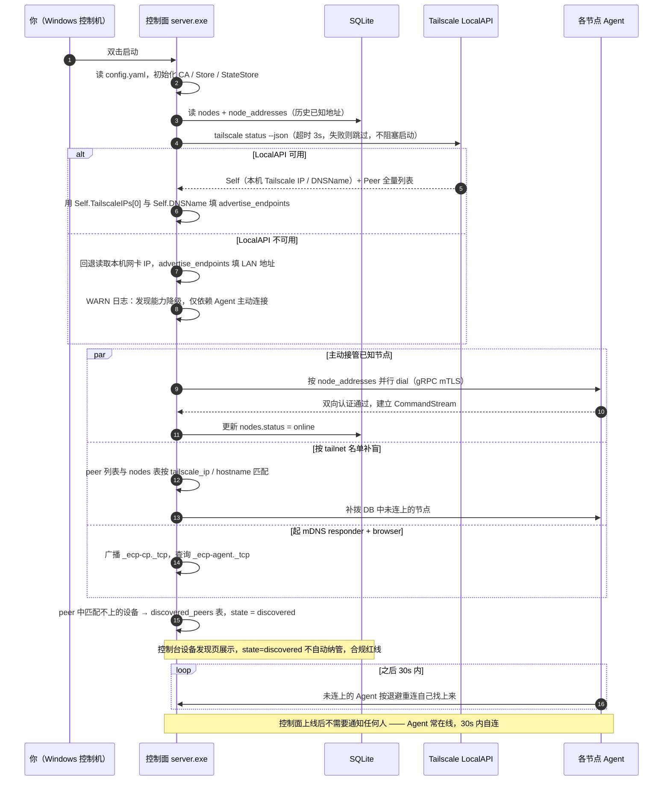
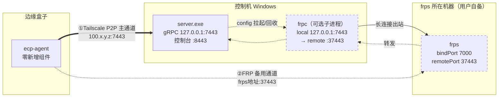
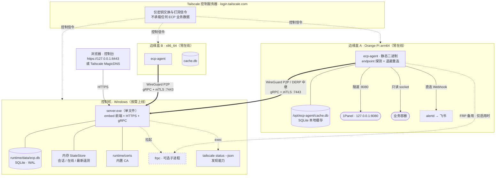
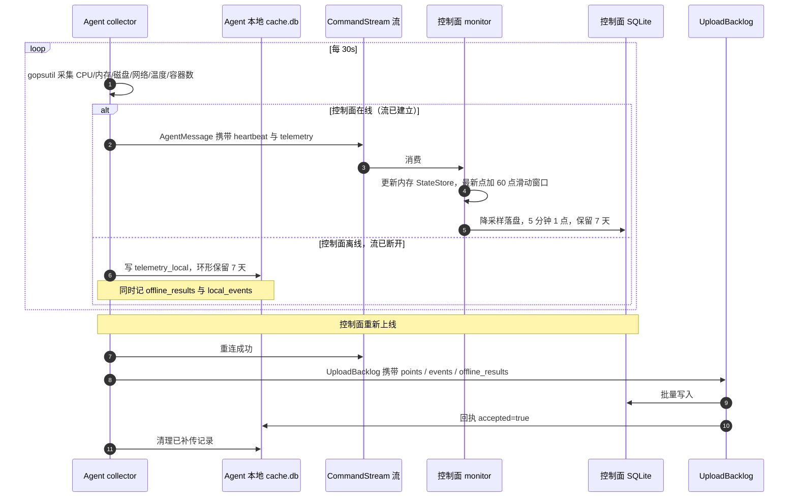
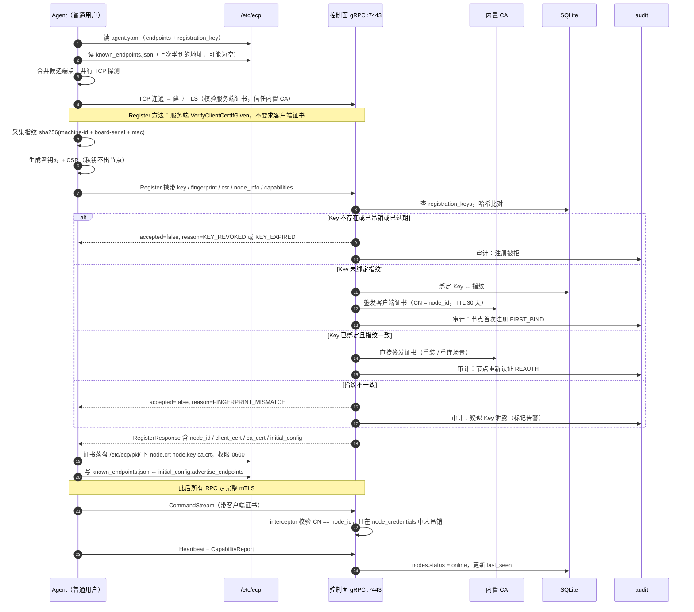
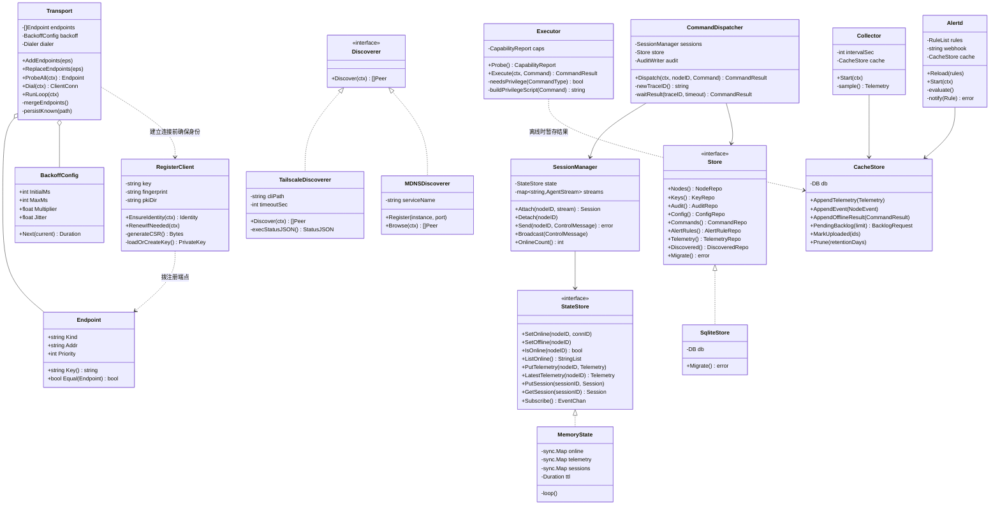
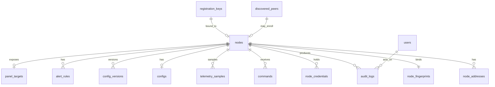

# 边缘计算节点控制平台 · 架构设计 v2.0（增量修订）

> 状态：**待确认**（确认后进入阶段三 · 开发落地）
> 依据：`docs/需求清单.md` v1.1 + `docs/架构设计.md` v1.0 + `proto/ecp/v1/ecp.proto`（已定稿）
> 创建时间：2026-08-29
> 本次修订触发：用户下达两处架构变更 —— ① 砍掉 Cloudflare Worker 引导层；② 改用 Tailscale + P2P + FRP（FRP 从二期提到一期）
>
> **本文件是 v1.0 的增量修订，不是替代品。** §1 明确列出 v1.0 哪些作废、哪些保留。凡本文未提及的 v1.0 内容，继续有效。

---

## 0. 一句话变更摘要

| 项 | v1.0 | v2.0 |
|---|---|---|
| 地址发现 | Cloudflare Worker + KV 双向注册 | **静态端点引导 + 控制面 Tailscale LocalAPI 发现 + mDNS 兜底**，地址随配置下发自愈 |
| 备用通道 | 无（FRP 排二期） | **FRP 作为控制面侧的可选出站暴露方式**（Agent 侧零组件） |
| 业务数据库 | PostgreSQL 16（Docker） | **SQLite（GORM + 纯 Go 驱动）**，PG 驱动留接口不实现 |
| 状态与会话 | Redis 7（Docker） | **进程内存（Go map + TTL 清理）**，Redis 驱动留接口不实现 |
| 遥测上行 | Mosquitto MQTT（Docker） | **整个砍掉**，心跳遥测走 gRPC `CommandStream`，离线走本地缓存 + `UploadBacklog` 补传 |
| 反向代理 | Caddy（Docker/二进制） | **整个砍掉**，控制台 HTTPS 与静态资源由 Go 单进程内置 |
| Docker Compose | 起三个基础设施 | **整个砍掉**，控制面零外部依赖 |
| `worker/` 目录 | CF Worker 引导服务 | **删除**，职责拆给 `server/internal/discover` 与 `scripts/gen-installer` |

**一句话**：v2.0 的目标是「**控制面 = 一个 exe 双击就跑，Agent = 一个静态二进制丢上去就跑，中间只有 Tailscale**」。

---

## 1. 变更影响分析（v1.0 哪些作废、哪些保留）

### 1.1 作废清单

| v1.0 位置 | 内容 | 处置 | 替代方案 |
|---|---|---|---|
| §1 架构图 | `BS` 引导层子图（Worker + KV）、`MQ` Mosquitto、`GW` Caddy | 删除 | 见 §2、§3 |
| §2.2 接入层 | Caddy 网关、Mosquitto | 删除 | 控制台 HTTPS 由 Go 内置（§3.4）；遥测走 gRPC 流 |
| §2.3 控制面 | `worker-sync` 模块 | 删除 | 新增 `discover` 模块（§2.3） |
| §2.5 存储层 | PostgreSQL 16、Redis 7 | 替换 | SQLite + 内存状态（§3） |
| §2.6 引导层 | 整节（两张 KV 表 + 三个端点） | 删除 | `nodes` + `node_addresses` 两张本地表 |
| §3.1 | 控制面启动与地址注册时序图 | 重写 | §2.4 场景 B |
| §3.2 | 节点首次注册时序图（含 Worker 交互） | 修订 | §4.1（去掉 Worker 两次调用，补 mTLS 升级） |
| §3.4 | 状态采集与控制面离线（走 MQTT） | 重写 | §3.5 |
| §4.3 | MQTT Topic 约定 | 删除 | 遥测并入 `Heartbeat.telemetry`；事件并入 `AgentMessage.event` |
| §4.4 | Worker API（三个端点） | 删除 | — |
| §6 选型理由 | MQTT 上行 + gRPC 下行、PostgreSQL、Redis、Mosquitto、Caddy、控制面跑本机不进 Docker 但依赖 compose | 修订 | §3.6 重述 |
| §8 部署形态 | docker-compose 起 PG/Redis/Mosquitto；Worker 云部署 | 重写 | §7 |
| §11 | 任务拆解 T1~T10（含 T6 Worker 引导服务） | 重写 | §5 |
| §12 待确认 | H4（CF Worker 现状） | 作废 | — |

### 1.2 保留清单（不受影响）

| v1.0 内容 | 状态 |
|---|---|
| 合规边界（§1 需求清单，做/不做表） | **完全不变**，继续作为硬红线 |
| "上线即控" = 注册 Key ↔ 硬件指纹绑定 + 自动重认证 + 全程审计 | **完全不变**。它依赖控制面本地 DB，不依赖地址簿，砍 Worker 无影响 |
| `proto/ecp/v1/ecp.proto` 全部内容 | **不改**。`Heartbeat.telemetry` + `UploadBacklog` 本来就是完整的遥测闭环，砍 MQTT 反而让契约更自洽 |
| 隧道复用（终端/文件/1Panel 端口转发共用 `Tunnel` 流） | **完全不变** |
| 1Panel 集成方案 B（控制机本地端口转发） | **完全不变**，红线不变（§6） |
| Agent 权限三档分级 + 能力探测 + 降级脚本 | **完全不变**（§9） |
| 控制面跑本机进程、不进容器 | **保留并强化** —— 现在连依赖的基础设施都不用容器了 |
| RBAC 三级、审计 append-only、凭据加密存储 | **完全不变** |
| 前端模块划分（§2.1） | **完全不变** |
| 节点侧目录布局 `/opt/ecp-agent`、`/etc/ecp`、端口 7443 | **保留**，端口 7883 释放（§7.4） |

### 1.3 变更带来的三个连锁反应（必须一并处理）

1. **注册通道不能再强制 mTLS**。原设计 Agent 第一次连上来是走 Worker 拿地址 → 直连控制面。现在 Worker 没了，但"Agent 首次无证书"这件事没变。**gRPC 服务端必须对 `Register` 方法放开客户端证书要求，其余方法强制 mTLS**。实现细节见 §8.2。
2. **控制面地址会变**（用户换机器、Tailscale 重装、IP 变动）。Worker KV 原来负责这个动态性。现在改为**控制面每次给 Agent 下发 `advertise_endpoints`，Agent 持久化到 `/etc/ecp/known_endpoints.json`**。静态配置只是 bootstrap 种子，不是最终态。
3. **`worker/` 目录失去存在意义**，需处置（§7.5）。

---

## 2. 网络与发现机制设计（Q1 / Q4）

### 2.1 问题的本质：一个不对称性

| | 控制面 | 节点 Agent |
|---|---|---|
| 在线时长 | 按需上线（用户开控制台才启动） | 常在线 |
| 网络位置 | 用户自己的 Windows，**有管理员权限** | 边缘盒，**只有普通用户** |
| 数量 | 1 | 试点 ≤ 500 |
| 地址稳定性 | 相对不稳定（会换） | Tailscale IP 稳定 |

**这个不对称性决定了整个设计：**

- **发现的重活放在控制面一侧**（它有权限调 `tailscale status`、能扫全 tailnet、能起 mDNS responder）
- **Agent 一侧只做一件事：拿着一串候选地址反复拨**。拨不上就等下一次退避，成本是一个失败的 TCP 握手。
- **不需要"控制面通知节点我上线了"这个机制**。Agent 常在线 + 退避重连 ≤ 30s，控制面一上线 30 秒内节点自己就找上来了。这是砍掉 Worker 后最大的简化 —— 原设计里"双向注册、谁在线谁发起"的复杂度，本质上是在解决一个**根本不存在的问题**。

### 2.2 Q1 结论：三级端点解析，静态配置为地基

| 级别 | 机制 | 在哪一侧 | 一期实现 | 说明 |
|---|---|---|---|---|
| **L1 主** | **静态/持久化端点列表 + 并行探测** | Agent | ✅ | Agent 配置 + 控制面下发的 `known_endpoints`，见 §2.3 |
| **L2 辅** | **Tailscale LocalAPI 枚举 peer** | **控制面** | ✅ | 控制面上线时主动 dial 已知节点 + 发现未纳管设备 |
| **L3 兜** | **mDNS（`_ecp-cp._tcp` / `_ecp-agent._tcp`）** | 双侧 | ✅（可配开关） | 解决 Tailscale 未装/故障、同 LAN 冷启动 |

**为什么 L1 是地基**：它是唯一**零依赖、零特权、100% 可预测**的方案。控制面地址是你自己写进去的，一年改不了一次。所有动态发现机制的元目标就是"把新地址回填进这个列表"。

**为什么 Tailscale LocalAPI 放在控制面侧而不是 Agent 侧**：
- Agent 是普通用户，Debian 上 `/run/tailscale/tailscaled.sock` 通常是 `srw-rw---- root:root`，普通用户读不到；`tailscale status` 在有 LocalAPI HTTP（127.0.0.1:41112）时可读，但**不是保证**。
- 控制面在你自己的 Windows 上，你是管理员，`tailscale status --json` 一定可用。
- **把需要权限/环境假设的事情，放在你有控制权的那一侧** —— 这条原则贯穿整个 v2.0。

**备选方案为什么不选**：
- ❌ 纯 mDNS 作主路：Windows 上需要 mDNS responder（Bonjour / Win11 内置），Tailscale 客户端不保证提供；且 mDNS 只在链路本地，跨网节点永远发现不了。
- ❌ 在 Agent 侧轮询 Tailscale LocalAPI：如上，权限不可靠。
- ❌ 自建一个"迷你 Worker"（比如塞到某个盒子上跑个地址服务）：引入了新的单点故障与运维负担，**而它解决的问题（控制面上线通知节点）本来就不存在**。这是本次变更最该警惕的诱惑。

### 2.3 L1：端点列表的定义与自愈

```go
// 端点种类
//   tailscale —— Tailscale IP 或 MagicDNS 名称，主通道
//   frp       —— frps 暴露出来的地址，备用通道（§2.6）
//   lan       —— 局域网 IP，mDNS 或配置下发
type Endpoint struct {
    Kind     string `yaml:"kind" json:"kind"`         // tailscale | frp | lan
    Addr     string `yaml:"addr" json:"addr"`         // host:port
    Priority int    `yaml:"priority" json:"priority"` // 越小越优先，默认按数组顺序
}
```

**Agent 侧的三层来源，按优先级合并去重**：

1. `/etc/ecp/agent.yaml` 的 `control_plane.endpoints` —— **安装时注入的种子**，人工维护
2. `/etc/ecp/known_endpoints.json` —— **控制面下发的、上次成功连上的地址**，Agent 每次成功连接后覆写
3. mDNS 发现的 `_ecp-cp._tcp` 实例地址 —— 仅当前 LAN 有效

**探测策略**：并行 TCP 拨号（1s 超时），谁先通谁赢；全不通 → 指数退避重连（`1s → 2s → 4s … 上限 30s`，±20% jitter）；每轮重连重新探测全部候选（因为控制面可能刚上线在新地址）。

**自愈闭环**（替代 Worker KV 的动态性）：

```
Agent 连上控制面
  → 控制面在 RegisterResponse.initial_config / ConfigPush 里带上自己的 advertise_endpoints
  → Agent 合并进候选列表，持久化到 /etc/ecp/known_endpoints.json
  → 下次重装/断网后，即使 agent.yaml 里的种子地址已失效，仍能用上次学到的地址连上
```

### 2.4 L2：控制面侧发现（Tailscale LocalAPI + mDNS）

**场景 B：控制面启动**



**关键实现约束**：
- **所有发现动作异步化、失败不阻塞启动**。Tailscale 没装、mDNS 被防火墙挡、`tailscale status` 超时 —— 任何一个挂了，控制面都得正常起来，只是发现能力降级。
- **控制面主动 dial 是加速手段，不是必需路径**。它的价值是把控制台首屏从"等 30s"缩短到"2s 全绿"。它挂了不影响系统可用性。
- **不引 `tailscale.com` Go 模块**（体量巨大、依赖地狱）。调 `exec.Command("tailscale", "status", "--json")` 解析 JSON 即可，CLI 路径可配、带 3s 超时。

### 2.5 Q4 结论：双向注册 → "节点主动连 + 控制面按名单找"

原机制「双方各向 Worker 注册地址，谁在线谁发起」重构为：

| 原机制 | v2.0 机制 | 复杂度变化 |
|---|---|---|
| Agent 向 Worker 注册自身地址 + 心跳续期 | **删除**。控制面通过 gRPC 流本身就知道节点在线 | −1 套心跳 |
| Agent 向 Worker 查询控制面地址 | **保留但降维**：静态端点列表 + 控制面回填（§2.3） | 从"网络查询"降为"读本地文件" |
| 控制面向 Worker 注册自身地址 | **删除** | −1 套注册 |
| 控制面从 Worker 拉节点表 | **改为**：读本地 SQLite + `tailscale status` 补盲 | 从"外部依赖"降为"本地读库" |
| 谁在线谁发起 | **保留**：Agent 主动连（主）+ 控制面主动 dial（辅） | 语义不变，去掉中间人 |

**净结果**：砍掉 1 个外部服务、2 套注册心跳、3 个 HTTP 端点、1 个引导令牌的生命周期管理。**节点表从"Worker KV + 控制面 DB 两份"收敛为"控制面 DB 一份"**，消除了双写不一致。

> ⚠️ **一个必须注意的语义变化**：原设计 Worker KV 有 48h TTL，节点失联 48h 后从注册表消失。现在节点永远留在控制面 DB 里，靠 `nodes.last_seen` 判定在线/离线（`state.ttl_sec = 90`，即 3 个心跳周期）。控制台要正确展示"离线节点"，而不是消失。

### 2.6 Q3 结论：FRP 是"控制面侧的可选出站暴露方式"，不是 Agent 功能

**这是本次分析最重要的一个发现，它把 FRP 从二期提前到一期的成本降到接近零。**

#### 关键洞察：frpc 该跑在控制机上，不是节点上

FRP 的目的是让节点能连到控制面。那么需要被穿透的是**控制面的 7443 端口**，也就是**控制机**。所以：

- **frpc 跑在控制机（Windows，你有管理员权限，和 server.exe 同生命周期）**
- **Agent 侧零新增组件** —— 它只是在端点列表里多了一个 `frp` 类型的地址

反过来（在每个节点上跑 frpc）是错的：Agent 只有普通用户权限、节点会频繁重装、500 个节点配 500 份 frpc —— 三重不可靠。

#### 拓扑



#### 落地上限：必须诚实面对"没有公网"

| 场景 | frps 放哪 | 可行性 | 结论 |
|---|---|---|---|
| **a. 家庭宽带 + 公网 IPv6** | 任意一台常开的盒子 / 家里一台机器，`bindAddr = "::"`，配 DDNS 的 AAAA 记录 | ✅ 真·公网可达，零成本 | **唯一可行的公网方案**。需确认用户是否有 IPv6 |
| **b. 纯 IPv4 家庭宽带（无公网）** | 放家里一台盒子，frps 只监听局域网 | ⚠️ 只能服务**同一局域网内**的节点 | 对"跨城的盒子"无解 |
| **c. 有云服务器 / 有公网 IPv4** | 云服务器 | ✅ | 用户明确没有，**排除** |
| **d. 无公网、节点全在异地** | 无解 | ❌ | **FRP 通道不启用，纯 Tailscale** |

**因此 Q3 的答案是：确认你的"配置驱动可选通道"方向，并进一步收紧为三条：**

1. **代码侧**：`transport` 包把端点类型和探测逻辑抽象出来；`server.yaml` 里 `transport.frp.enabled` 为 `false` 时，FRP 相关代码路径完全不执行，frpc 子进程不拉起。**默认关闭。**
2. **部署侧**：提供 `deploy/frp/frps.toml.example` + `frpc.toml.example` + 一份"什么情况下才值得启用 FRP"的决策说明。**不在一期追求在用户当前环境跑通** —— 在用户没有公网/IPv6 的前提下硬跑 frps，就是亲手造出"又一个跑不起来的依赖"。
3. **交互侧**：server 启动检测到 `frp.enabled=true` 时，自动拉起 frpc 子进程、把 `frps地址:remotePort` 写进 `advertise_endpoints`，随 `initial_config` 下发给 Agent。**Agent 连一行配置都不用手写**；server 退出时回收 frpc 子进程。

**FRP 只改变"怎么连到 7443"，不改变其上的 mTLS 与业务协议。** 它出问题只影响连通性，不影响安全模型。工程师实现时不要把它和鉴权、会话、隧道混在一起。

> 一期不做 FRP 的管理 UI（C4 仍在二期）。一期只交付"传输抽象 + 配置驱动 + frpc 子进程托管 + 部署文档"。

### 2.7 完整网络拓扑（v2.0）



**两条红线，读图时请记住**：
1. Tailscale 只提供 IP 层连通。**业务数据即使走 DERP 中继，上面还有 ECP 自己的 mTLS**，Tailscale 侧看不到明文。
2. Agent 到 1Panel 只有"隧道转发"这一种关系。**不读 1Panel 凭据、不改 1Panel 配置**（A6）。

---

## 3. 存储层决策（Q2）

### 3.1 结论：选 (c) 变体「默认自包含零依赖，驱动接口预留」

| 组件 | v1.0 | v2.0 | 驱动接口 | 一期是否实现第二驱动 |
|---|---|---|---|---|
| 业务数据 | PostgreSQL 16（Docker） | **SQLite（WAL）** | `Store` | ❌ 只留接口，不写 PG 实现 |
| 在线状态 / 会话 | Redis 7（Docker） | **进程内存**（`sync.Map` + TTL goroutine） | `StateStore` | ❌ 只留接口，不写 Redis 实现 |
| 遥测 | Mosquitto（Docker） | **gRPC `CommandStream` 实时 + SQLite 降采样落盘** | — | — |
| 反向代理 | Caddy | **Go 内置 `net/http` + embed** | — | — |

### 3.2 论证

**为什么不选 (b) 要求用户装 Docker Desktop**
- Windows 家庭版需要 WSL2，涉及 BIOS 开虚拟化、系统组件安装、重启 —— 一串可能失败的前置步骤。
- Docker Desktop 有商业授权限制（超过 250 人或 $10M 收入需付费），对"个人管理几个盒子"的场景是负担。
- 用户从没提过要装，且**明确说了没装**。
- 最致命的：控制面是"按需启动的管理终端"。启动成本从**双击一个 exe**变成**等 10 分钟容器编排**，直接违背 A2/B4 的设计前提。

**为什么不选 (a) 纯自包含**
- 把 PG/Redis 永久关在门外。用户哪天搞了台常开的机器或 NAS，想把平台搬上去 7×24 跑，就得重写存储层。
- **但 (a) 的两个核心判断是对的，全部吸收**：SQLite 存业务数据、内存存会话状态。

**为什么 (c) 变体是对的**
- 一期交付零外部依赖（符合用户现实），二期切 PG/Redis 只需换 driver 实现 + 改配置，**业务代码不动**。
- 代价极小：两个接口 + 一层薄封装，约 200 行。
- **但要克制**：一期**不实现** PG/Redis 驱动，只留接口签名 + `driver: sqlite|postgres` 的配置校验（`postgres` 时返回"未实现"错误）。写了不用 = 维护负担 + 假的可移植性。

### 3.3 一个决定性的技术理由：SQLite 驱动必须纯 Go

Agent 的硬约束是 **`CGO_ENABLED=0` 的单文件静态二进制、arm64/amd64 交叉编译**。

| 驱动 | CGO | 交叉编译 | 结论 |
|---|---|---|---|
| `github.com/mattn/go-sqlite3`（`gorm.io/driver/sqlite` 默认用这个） | ✅ 需要 | ❌ 破坏静态编译 | **禁用** |
| `modernc.org/sqlite`（`github.com/glebarez/sqlite`） | ❌ 不需要 | ✅ | **采用** |

**控制面和 Agent 用同一套**（`gorm.io/gorm` + `github.com/glebarez/sqlite`），两边依赖统一，Agent 的本地缓存和控制面的业务库是同一套代码路径。

> ⚠️ 已知成本：`modernc.org/sqlite` 是把 C 转译的 Go 代码，体量大，**首次编译约 1–3 分钟**，交叉编译 arm64 更慢。T1 阶段必须配好 `GOCACHE` 与 `GOMODCACHE`（隔离到 `.venv/<组件>/pkg/mod`），后续增量编译可接受。**这个成本是"静态单文件二进制"硬约束的必付代价，没有绕过方案。**

### 3.4 关于 MQTT / Mosquitto：**整个砍掉**

| 理由 | 说明 |
|---|---|
| ① 跑不起来 | 控制机没有 Docker，Windows 上装 Mosquitto 是原生服务安装，另一串前置步骤 |
| ② 语义完全重复 | `Heartbeat` 消息**已经内嵌 `Telemetry`**（proto 第 156–178 行）。控制面在线 → gRPC 流实时拿；控制面离线 → Agent 写本地 SQLite → 上线后 `UploadBacklog` 补传。**proto 里本来就是完整闭环，MQTT 是多出来的第三套通道** |
| ③ 少一整套运维 | 少一个 broker 进程、一套 ACL、一套 TLS 证书、一个端口（7883）、一份备份策略 |
| ④ 原选型理由已失效 | v1.0 选 MQTT 的理由是"高频小包、允许丢、QoS 语义匹配"。但 gRPC 流里发心跳本来就是单向 fire-and-forget（Agent `Send()` 后不等 ack），语义等价；且 gRPC 已经有 mTLS，不需要再给 Mosquitto 单独配一套 TLS |
| ⑤ 反向论证 | "MQTT 传 SSH 流要自己做分片和顺序保证" —— 这条 v1.0 的理由反过来也成立：既然所有业务都在 gRPC 上了，为遥测单独保留一个协议栈没有任何收益 |

**结论：Mosquitto 整个砍掉，7883 端口释放，MQTT Topic 约定（v1.0 §4.3）作废。**

### 3.5 遥测链路（砍掉 MQTT 后的完整闭环）



**降采样是关键的写入减压手段**。500 节点 × 1 点/5 分钟 = 1.67 write/s。加上审计日志与配置写入，SQLite 总写入压力 < 30 write/s —— **WAL 模式下 SQLite 可以轻松承受数千 write/s，毫无压力**。

### 3.6 技术选型理由（v2.0 增补/修订）

| 选型 | 结论 |
|---|---|
| **SQLite 而非 PostgreSQL** | 控制面按需上线，峰值写入 < 30 write/s，SQLite WAL 绰绰有余；零外部依赖压倒一切。**但"审计日志 + 配置版本需要事务"这个诉求 SQLite 完全满足**（WAL 下支持完整 ACID）。真正的劣势（并发写入、水平扩展）在这个场景下不出现 |
| **内存 StateStore 而非 Redis** | 在线状态和会话本来就是易失数据 —— v1.0 自己写的是"控制面重启后可丢，节点状态由重连重建"。既然语义上就该丢，放内存是最诚实的表达。PubSub 需求用 Go channel + 会话表广播实现（控制台就一个实例，不需要跨实例广播） |
| **gRPC 流而非 MQTT** | 见 §3.4 |
| **砍掉 Caddy，Go 内置 HTTPS** | 控制台是本机/Tailscale 访问，Go 标准库 `net/http` + `embed` 完全够用。加 Caddy = 又一个 Windows 上没有的二进制 + 一份要维护的配置 |
| **不引 `tailscale.com` Go 模块** | 巨大且依赖复杂。调 CLI 解析 JSON，3 秒超时，失败降级 |
| **不引 `github.com/docker/docker`** | 体量大、版本标记 `+incompatible`。Agent 侧直接 HTTP over `/var/run/docker.sock` 调 Engine API，只实现 `list / start / stop / restart / logs` 五个端点，约 150 行 |
| **日志用标准库 `log/slog`** | Go 1.27 的 slog 足够（JSON handler、层级、attrs）。不引第三方日志库 |

---

## 4. 关键流程（替换 v1.0 §3.1 / §3.2 / §3.4）

### 4.1 Agent 首次注册 + mTLS 升级



**"上线即控"在这里完整保留**：重装后 `/etc/ecp` 丢失 → 用户用同一份 Key 重新执行安装脚本 → 走「Key 已绑定且指纹一致」分支 → 自动签发证书，零人工审批，但每次都留审计。

> **红线**：`node_info` 里的 `machine_id` / `mac_addrs` 只用于指纹计算与控制台展示，**不做任何形式的设备追踪或跨节点关联以外的用途**。

### 4.2 指令下发与能力降级（沿用 v1.0 §3.3，仅补充）

v1.0 §3.3 的时序图**继续有效**，仅补充两点：

1. **`requires_privilege` 由控制面预判定**（proto `Command.requires_privilege`）：控制面根据节点上报的 `CapabilityReport` 判断该操作是否需要提权，直接返回 `NEEDS_PRIVILEGE` + `privilege_script`，**不下发给节点空跑一趟**。
2. **能力探测结果每次重连上报**：节点可能中途被加进 docker 组、或 tailscale 被装上了。控制面要更新 `nodes.capabilities` 快照，控制台据此动态显示功能可用性。

### 4.3 告警（沿用 v1.0 §3.5，不改）

节点本地规则引擎 + 飞书直连，**完全不依赖控制面，也不依赖 Tailscale**。控制面只负责下发/更新规则（`COMMAND_TYPE_ALERT_RULE_SYNC`）。v1.0 §3.5 时序图继续有效。

---

## 5. 任务分解

> **5 个顶层任务，每个含子步骤。** 依赖关系：`T1 → T2 → {T3 ∥ T4} → T5`
> 每个子步骤完成后：写 `开发日志/<Agent名称>/<日期时间>/任务.md`（目标 / 变更文件 / 关键决策 / 遗留问题）→ Git 提交（Conventional Commits + 编号）→ 更新 `开发日志/README.md` 编号表。


---

### T1 · 工程基座与存储层

- **依赖**：无
- **优先级**：P0
- **目标**：让两个 Go 模块能独立编译、控制面能起来建库、Arm64 静态二进制能交叉编译出来。

**子步骤与文件**

| # | 内容 | 涉及文件 |
|---|---|---|
| 1.1 | 虚拟环境初始化：GOMODCACHE 隔离到 `.venv/server/pkg/mod`、`.venv/agent/pkg/mod`、`.venv/proto/pkg/mod`（已存在）；`.venv/web` 建 npm 环境；`.venv/tools` 建 Python 环境 | `.venv/*`、`scripts/env.ps1`、`scripts/env.sh` |
| 1.2 | 删除 CF Worker 残留 | `git rm -r worker/`、`.gitignore`（删 Worker 段）、`.venv/worker/`（删除）、`开发日志/README.md`（删 H4） |
| 1.3 | 建 Go module | `server/go.mod`、`agent/go.mod`（均 `go 1.27.0`，`replace ecp.dev/ecp/proto => ../proto`） |
| 1.4 | 配置加载 | `server/internal/config/config.go`、`agent/internal/config/config.go`、`deploy/config/server.yaml.example`、`deploy/config/agent.yaml.example`（字段见 §8.3） |
| 1.5 | 日志与错误码 | `server/internal/logx/`、`agent/internal/logx/`（slog JSON handler）、`server/internal/apierr/codes.go`（§8.1） |
| 1.6 | 存储层 | `server/internal/store/store.go`（接口）、`store/sqlite/`（GORM + glebarez）、`store/model/`（13 张表实体）、`store/migrate.go` |
| 1.7 | 状态层 | `server/internal/state/state.go`（接口）、`state/memory/`（sync.Map + TTL goroutine） |
| 1.8 | Agent 本地缓存 | `agent/internal/cache/cache.go` + `cache/model/`（4 张表） |
| 1.9 | 构建脚本 | `scripts/build.ps1`、`scripts/build.sh`（`CGO_ENABLED=0`，`GOOS=linux GOARCH=arm64|amd64`，`GOOS=windows GOARCH=amd64`，`-ldflags "-s -w"`） |
| 1.10 | 最小可跑骨架 | `server/cmd/server/main.go`、`agent/cmd/agent/main.go`（打印版本 + 建库 + 优雅退出） |

**验收标准**
- [ ] `scripts/build.ps1` 一键产出 `dist/server.exe`（windows/amd64）、`dist/ecp-agent-linux-arm64`、`dist/ecp-agent-linux-amd64`
- [ ] `file dist/ecp-agent-linux-arm64` 输出含 `statically linked`；`ldd` 报 `not a dynamic executable`
- [ ] arm64 二进制 scp 到 Orange Pi 上能执行 `./ecp-agent-linux-arm64 version`（普通用户权限）
- [ ] `server.exe` 首次启动自动生成 `runtime/data/ecp.db`，13 张表建齐，WAL 模式生效（`PRAGMA journal_mode` 返回 `wal`）
- [ ] 三个 `go.mod` 的 `GOMODCACHE` 各自独立，互不污染
- [ ] 全部 `CGO_ENABLED=0`

**关键决策与风险**
- **决策**：SQLite 驱动选 `github.com/glebarez/sqlite`（纯 Go），禁用 `mattn/go-sqlite3`。**理由**：Agent 必须 `CGO_ENABLED=0` 静态编译。
- **风险**：`modernc.org/sqlite` 首次编译慢（1–3 分钟）。**缓解**：T1 内完成首次编译并固化 `GOCACHE`，后续增量编译正常。
- **决策**：`worker/` 整体删除。**理由**：CF 砍掉后其职责（地址映射表、引导服务）已被 `server/internal/discover` + 控制面本地 `node_addresses` 表 + `scripts/gen-installer`（二期）吸收，留着是死代码。

---

### T2 · 传输层与注册鉴权（打通主链路）

- **依赖**：T1
- **优先级**：P0
- **目标**：Agent 能在 Orange Pi 上注册成功、拿到证书、建立 mTLS 长流；控制面重启后 30s 内自动重连；控制面能主动发现节点。
- **⚠️ 本任务必须留一个 echo executor stub**，否则 T3 无法独立联调（T3 下发指令需要 Agent 有东西回）。

**子步骤与文件**

| # | 内容 | 涉及文件 |
|---|---|---|
| 2.1 | 端点解析与探测 | `agent/internal/transport/endpoint.go`、`probe.go`、`dialer.go` |
| 2.2 | 退避重连状态机 | `agent/internal/transport/reconnect.go`（指数退避 + jitter，上限 30s） |
| 2.3 | FRP 通道（配置驱动） | `agent/internal/transport/frp.go`、`server/internal/frp/host.go`（frpc 子进程托管）、`deploy/frp/frps.toml.example`、`deploy/frp/frpc.toml.example` |
| 2.4 | mDNS | `agent/internal/mdns/`、`server/internal/discover/mdns.go`（`github.com/grandcat/zeroconf`） |
| 2.5 | 注册与证书管理 | `agent/internal/register/`（CSR、Register 调用、证书落盘、TTL 到期前 25% 自动续期）、`server/internal/ca/`（内置 CA、签发/吊销）、`server/internal/registry/`（Key↔指纹绑定） |
| 2.6 | gRPC 服务端与 mTLS interceptor | `server/internal/grpcserver/server.go`、`interceptor.go`（**`Register` 用 `VerifyClientCertIfGiven`，其余方法强制校验 CN==node_id**） |
| 2.7 | 会话与在线判定 | `server/internal/session/`（流会话表、心跳驱动、`state.ttl_sec=90` 判定离线） |
| 2.8 | 控制面发现 | `server/internal/discover/tailscale.go`（exec `tailscale status --json`，3s 超时，失败降级）、`discover/orchestrator.go`（DB 名单 + peer 补盲 + discovered_peers） |
| 2.9 | echo executor stub | `agent/internal/executor/echo.go`（回显，供 T3 联调，T4 替换） |

**验收标准**
- [ ] Orange Pi 上 Agent 用注册 Key 首次注册成功，`/etc/ecp/pki/` 下生成 `node.crt`/`node.key`/`ca.crt`（权限 0600）
- [ ] 杀掉 server.exe 再启动，Agent 在 **30s 内自动重连**，控制台节点状态从 offline 变 online
- [ ] **模拟重装**：删掉 `/etc/ecp/pki/`（保留 agent.yaml 的 Key），Agent 自动走 `REAUTH` 分支重新拿到证书，无需任何人工操作
- [ ] **模拟 Key 泄露**：改 machine-id 使指纹变化，控制面返回 `FINGERPRINT_MISMATCH` 并写审计
- [ ] 直接调 `CommandStream` 不带客户端证书 → 被拒；带证书但 CN 与 node_id 不符 → 被拒
- [ ] 控制面启动时 `tailscale status` 不可用（模拟：把 PATH 里的 tailscale 移走）→ server 正常启动，日志 WARN，Agent 仍能主动连上
- [ ] `frp.enabled=false` 时，FRP 代码路径完全不执行，无 frpc 子进程
- [ ] `known_endpoints.json` 在首次连接后被正确写入，且 Agent 重启后优先使用它

---

### T3 · 控制面能力编排与 API

- **依赖**：T2
- **优先级**：P0
- **目标**：所有 REST/WebSocket 接口可用，指令从控制台下发到 Agent 再回传结果的全链路打通。

**子步骤与文件**

| # | 内容 | 涉及文件 |
|---|---|---|
| 3.1 | JWT + RBAC | `server/internal/auth/`（登录、bcrypt、JWT、三级角色中间件） |
| 3.2 | 指令编排 | `server/internal/command/`（trace_id 生成、超时、并发控制、结果回传、重试策略） |
| 3.3 | 五个能力适配器 | `server/internal/capability/terminal.go`、`filemgr.go`、`netctl.go`、`tsops.go`、`dockerops.go` |
| 3.4 | 隧道会话管理 | `server/internal/tunnel/`（session 表、resize/close、空闲回收） |
| 3.5 | 1Panel 本地端口转发 | `server/internal/panelrelay/`（127.0.0.1:19000-19999 监听、票据、审计、空闲 10min 断开） |
| 3.6 | 遥测与补传 | `server/internal/monitor/`（内存滑动窗口 + 降采样落盘）、`server/internal/backfill/`（`UploadBacklog` 处理） |
| 3.7 | 告警规则与审计 | `server/internal/alert/`、`server/internal/audit/`（append-only，所有写操作中间件） |
| 3.8 | REST + WebSocket | `server/internal/api/`（Gin 路由全量表，见 v1.0 §4.2；`/api/v1/nodes/{id}/terminal` 与 `/ws/status` 走 WebSocket） |
| 3.9 | 前端 embed 与静态托管 | `server/internal/web/embed.go`（`//go:embed`，支持 `web.mode=dir` 开发热更） |

**验收标准**
- [ ] v1.0 §4.2 表格中的全部 REST 接口联调通过，返回结构统一为 `{code, message, data}`（§8.1）
- [ ] 指令下发全链路：控制台提交 → 控制面写审计 → gRPC 下发 → Agent 回传 → 控制面更新审计 → 控制台展示（用 T2 的 echo stub 验证）
- [ ] 无权限操作返回 `RESULT_STATUS_NEEDS_PRIVILEGE` + `privilege_script`，不静默失败
- [ ] 只读角色调写接口 → 403 + 审计记录"权限不足"
- [ ] 所有 POST/PUT/DELETE 都有审计记录，审计表无 UPDATE/DELETE 接口
- [ ] 1Panel 隧道：申请后返回 `http://127.0.0.1:19037/{entrance}`，浏览器打开能看到 **1Panel 登录页**（不是已登录状态 —— 证明没绕过鉴权）
- [ ] 隧道监听只绑 127.0.0.1（`netstat` 验证无 0.0.0.0 绑定），空闲 10 分钟自动断开
- [ ] `UploadBacklog` 接收补传数据并落库

---

### T4 · Agent 能力模块与本地自治

- **依赖**：T2
- **优先级**：P0
- **目标**：Agent 能真正干活（终端/文件/网络/容器），能采集、能离线自治、能本地告警、有本地 CLI。

**子步骤与文件**

| # | 内容 | 涉及文件 |
|---|---|---|
| 4.1 | 能力探测 | `agent/internal/executor/probe.go`（uid、docker 组、命令存在性、路径可写性 → `CapabilityReport`） |
| 4.2 | 三档权限与降级 | `agent/internal/executor/policy.go`、`privilege.go`（生成 sudo 脚本） |
| 4.3 | 指令执行器 | `agent/internal/executor/shell.go`、`file.go`、`net.go`、`firewall.go`、`tailscale.go`、`docker.go`（HTTP over `/var/run/docker.sock`，**不引 docker/docker 包**）、`logquery.go`、`upgrade.go` |
| 4.4 | 状态采集 | `agent/internal/collector/`（gopsutil v4：CPU/内存/磁盘/网络/温度/容器数） |
| 4.5 | 本地缓存与补传 | `agent/internal/cache/`（telemetry 环形 7 天、offline_results、local_events）、`agent/internal/backfill/`（重连后触发 `UploadBacklog`） |
| 4.6 | 本地告警引擎 | `agent/internal/alertd/`（规则解析、robfig/cron 评估、飞书 Webhook 直连、本地告警历史） |
| 4.7 | 隧道服务端 | `agent/internal/tunnel/pty.go`（creack/pty）、`file.go`、`portfwd.go` |
| 4.8 | 节点本地 CLI | `agent/internal/ecli/`（unix socket `/run/user/{uid}/ecp-agent.sock`，0600；`status`/`reconnect`/`config`/`logs`） |
| 4.9 | systemd 单元 | `deploy/systemd/ecp-agent.service`（**用户级**，`~/.config/systemd/user/`） |

**验收标准**
- [ ] 终端：`CommandStream` 建立后开 pty，`ls`、`top` 交互正常，resize 生效
- [ ] 文件：目录列举、上传、下载、在线编辑、删除、权限查看全部通过
- [ ] 网络：网卡/IP/DNS/hosts 读取成功；iptables 下发在普通用户下返回 `NEEDS_PRIVILEGE` + 可执行脚本，人工 `sudo bash` 后规则生效
- [ ] 容器：`docker ps` 列出；启停在有 docker 组时成功，无组时降级为脚本
- [ ] 采集：每 30s 一条 `Heartbeat`，控制台资源水位实时刷新
- [ ] **离线自治**：关掉控制面 10 分钟，期间 Agent 正常采集、正常告警；重启控制面后缓存数据自动补传，控制台能看到离线区间的曲线
- [ ] **告警**：`stress` 打满 CPU 触发规则，飞书收到消息（控制面全程关闭）
- [ ] `ecli status` 输出节点 ID/在线状态/最后心跳时间/能力清单
- [ ] 用户级 systemd 单元 `systemctl --user enable --now ecp-agent` 成功，重启盒子后 Agent 自启

---

### T5 · 前端控制台与端到端真机验证

- **依赖**：T3、T4
- **优先级**：P0
- **目标**：浏览器打开就能用，全部功能走通，真机验证完成，交付物齐备。

**子步骤与文件**

| # | 内容 | 涉及文件 |
|---|---|---|
| 5.1 | 前端工程基座 | `web/package.json`、`vite.config.ts`、`tsconfig.json`、`.venv/web/`（npm ci） |
| 5.2 | 布局与路由 | `web/src/layout/`、`router/`、`stores/`（Pinia：user / node / terminal） |
| 5.3 | API 层 | `web/src/api/`（axios 封装 + 统一错误码处理 + JWT 拦截器） |
| 5.4 | 节点总览与详情 | `web/src/views/node/`（列表、在线状态、资源水位 ECharts、批量操作） |
| 5.5 | Web SSH 终端 | `web/src/views/terminal/`（xterm.js + fit + web-links addon，多标签、断线重连） |
| 5.6 | 文件管理器 | `web/src/views/file/`（树 + 列表 + 上传下载 + 在线编辑） |
| 5.7 | 网络 / Tailscale / 容器 | `web/src/views/network/`、`views/tailscale/`、`views/container/` |
| 5.8 | 设备发现页 | `web/src/views/discovery/`（**新增**：展示 `discovered_peers`，手动纳管入口，不自动纳管） |
| 5.9 | 告警 / 审计 / 用户 | `web/src/views/alert/`、`views/audit/`、`views/user/` |
| 5.10 | 1Panel 入口 | `web/src/views/panel/`（一键打开本地转发地址，展示安全提示） |
| 5.11 | 构建与嵌入 | `web/vite build` → `server/internal/web/dist` → embed 进 `server.exe` |
| 5.12 | 一键启动 | `scripts/start.ps1`（双击启动 + 打开浏览器 + 日志落盘） |
| 5.13 | 真机端到端验证 | Orange Pi 全流程；`开发日志/` 补齐；`开发日志/README.md` 更新编号表；Git 提交 |

**验收标准**
- [ ] `npm run build` 零错误，`vue-tsc` 类型检查通过
- [ ] 浏览器打开 `https://127.0.0.1:8443`，节点列表显示 Orange Pi 在线，资源水位实时刷新
- [ ] Web SSH 终端可交互，`vim` 编辑正常，中文不乱码，resize 跟随窗口
- [ ] 文件管理器上传一个 10MB 文件成功，在线编辑保存成功
- [ ] 网络页能看到网卡/IP/DNS/hosts；iptables 下发弹出"请手动执行"脚本框
- [ ] 容器页能列出、启停容器
- [ ] 1Panel 入口点开跳到 `127.0.0.1:19xxx`，显示 1Panel 登录页
- [ ] 审计页能按人/节点/时间/操作类型检索，能看到本次验证的全部操作
- [ ] 设备发现页显示 tailnet 里未被纳管的设备（若有），且**未自动纳管**
- [ ] 全部开发日志写入，Git 提交编号连续，Conventional Commits 规范

---

## 6. 依赖包列表

### 6.1 Go（三个 module 共用一份版本约束）

**server/go.mod**（控制面）

```
module ecp.dev/ecp/server

go 1.27.0

require (
    ecp.dev/ecp/proto v0.0.0
    github.com/gin-gonic/gin v1.10.0
    github.com/glebarez/sqlite v1.11.0
    github.com/golang-jwt/jwt/v5 v5.2.1
    github.com/google/uuid v1.6.0
    github.com/gorilla/websocket v1.5.3
    github.com/grandcat/zeroconf v1.0.0
    github.com/robfig/cron/v3 v3.0.1
    github.com/spf13/cobra v1.9.1
    github.com/stretchr/testify v1.10.0
    golang.org/x/crypto v0.32.0
    google.golang.org/grpc v1.71.0
    google.golang.org/protobuf v1.36.10
    gopkg.in/yaml.v3 v3.0.1
    gorm.io/gorm v1.25.12
)

replace ecp.dev/ecp/proto => ../proto
```

**agent/go.mod**（数据面）

```
module ecp.dev/ecp/agent

go 1.27.0

require (
    ecp.dev/ecp/proto v0.0.0
    github.com/creack/pty v1.1.21
    github.com/glebarez/sqlite v1.11.0
    github.com/google/uuid v1.6.0
    github.com/grandcat/zeroconf v1.0.0
    github.com/robfig/cron/v3 v3.0.1
    github.com/shirou/gopsutil/v4 v4.25.1
    github.com/spf13/cobra v1.9.1
    github.com/stretchr/testify v1.10.0
    golang.org/x/term v0.29.0
    google.golang.org/grpc v1.71.0
    google.golang.org/protobuf v1.36.10
    gopkg.in/yaml.v3 v3.0.1
    gorm.io/gorm v1.25.12
)

replace ecp.dev/ecp/proto => ../proto
```

| 包 | 版本 | 用途 | 备注 |
|---|---|---|---|
| `google.golang.org/grpc` | v1.71.0 | gRPC 全链路 | 已在 `proto/go.mod` 锁定，跟随 |
| `google.golang.org/protobuf` | v1.36.10 | 消息编解码 | 同上 |
| `gorm.io/gorm` | v1.25.12 | ORM | 与 Agent 共用，便于二期切 PG |
| `github.com/glebarez/sqlite` | v1.11.0 | SQLite 驱动（**纯 Go**） | **禁用 mattn/go-sqlite3（CGO）** |
| `github.com/gin-gonic/gin` | v1.10.0 | REST 框架 | |
| `github.com/gorilla/websocket` | v1.5.3 | 终端 / 实时状态 | |
| `github.com/golang-jwt/jwt/v5` | v5.2.1 | JWT | |
| `golang.org/x/crypto` | v0.32.0 | bcrypt、AES-GCM 凭据加密 | |
| `github.com/google/uuid` | v1.6.0 | node_id / session_id | |
| `github.com/grandcat/zeroconf` | v1.0.0 | mDNS 服务注册与发现 | 双侧使用，可配开关 |
| `github.com/robfig/cron/v3` | v3.0.1 | 告警评估调度、遥测降采样、缓存清理 | |
| `github.com/spf13/cobra` | v1.9.1 | `server` 子命令、`ecli` CLI | |
| `github.com/shirou/gopsutil/v4` | v4.25.1 | 状态采集（跨平台） | 仅 Agent |
| `github.com/creack/pty` | v1.1.21 | pty 终端 | **仅 Linux**，Windows 编译需 build tag 隔离 |
| `golang.org/x/term` | v0.29.0 | 终端尺寸 | 仅 Agent |
| `gopkg.in/yaml.v3` | v3.0.1 | 配置文件 | |
| `github.com/stretchr/testify` | v1.10.0 | 测试断言 | |

**明确不引入的包**（避免依赖地狱，工程师请勿自行添加）

| 包 | 不引的理由 |
|---|---|
| `tailscale.com` | 体量巨大、依赖复杂。改用 `exec tailscale status --json` 解析 |
| `github.com/docker/docker` | 体量大、`+incompatible` 版本标记。改用 HTTP over `/var/run/docker.sock` |
| `github.com/mattn/go-sqlite3` | 需要 CGO，破坏静态编译硬约束 |
| `github.com/redis/go-redis`、`gorm.io/driver/postgres` | 一期不实现第二驱动，只留接口 |
| 第三方日志库（zerolog/zap/logrus） | Go 1.27 标准库 `log/slog` 足够 |
| MQTT 客户端（paho 等） | MQTT 整个砍掉 |

### 6.2 npm（`web/package.json`）

```json
{
  "dependencies": {
    "vue": "^3.5.13",
    "vue-router": "^4.5.0",
    "pinia": "^2.3.0",
    "element-plus": "^2.9.1",
    "@element-plus/icons-vue": "^2.3.1",
    "axios": "^1.7.9",
    "echarts": "^5.5.1",
    "dayjs": "^1.11.13",
    "@xterm/xterm": "^5.5.0",
    "@xterm/addon-fit": "^0.10.0",
    "@xterm/addon-web-links": "^0.11.0"
  },
  "devDependencies": {
    "@vitejs/plugin-vue": "^5.2.1",
    "typescript": "~5.7.2",
    "vite": "^6.0.7",
    "vue-tsc": "^2.2.0",
    "@types/node": "^22.10.5"
  }
}
```

> **版本说明**：T1/T5 执行时用 `npm install` / `go get` 解析实际版本并回填 `package-lock.json` / `go.sum`。上表为**下限约束**，不得降版本；升 minor 需记录在开发日志。

---

## 7. 部署形态与目录布局

### 7.1 控制机（Windows）— 一个 exe 走天下

```
ecp-control/
├── server.exe                  # 单文件（embed 前端 + HTTPS + gRPC）
├── config.yaml                 # 首次启动自动生成带注释的默认配置
├── runtime/
│   ├── data/ecp.db             # SQLite（WAL），业务数据
│   ├── certs/                  # 内置 CA + 服务端证书 + 已签发节点证书台账
│   ├── frp/                    # 仅 frp.enabled=true 时存在
│   └── logs/server.log         # 滚动日志
└── start.ps1                   # 双击启动（默认）或手动
```

**首次启动交互**：`server.exe` 检测到 `runtime/certs` 不存在 → 自动生成内置 CA + 服务端证书 → 生成默认 `config.yaml` → 提示初始超管账号密码（**只显示一次**）→ 自动打开浏览器。

### 7.2 节点（Linux）— 完全隔离，遵守 A6

```
/opt/ecp-agent/
├── ecp-agent                   # 静态二进制
└── cache.db                    # 本地 SQLite 缓存（环形 7 天）
/etc/ecp/
├── agent.yaml                  # 配置（含 endpoints + registration_key）
├── known_endpoints.json        # 控制面下发的地址（自动生成）
├── alert-rules.yaml            # 告警规则（控制面下发）
└── pki/{ca.crt, node.crt, node.key}   # 证书，0600
~/.config/systemd/user/ecp-agent.service
/run/user/{uid}/ecp-agent.sock  # ecli 本地控制端点，0600
```

### 7.3 部署矩阵

| 组件 | v1.0 运行方式 | v2.0 运行方式 |
|---|---|---|
| 控制面 Server | 本机二进制 + compose 起三个依赖 | **单 exe，零外部依赖** |
| PostgreSQL / Redis / Mosquitto | Docker Compose | **全部取消** |
| Caddy | 二进制/容器 | **取消**（Go 内置） |
| frpc | 无 | **可选子进程**，server 托管生命周期 |
| Agent | 用户级 systemd | 不变 |
| Cloudflare Worker | 云部署 | **取消**（目录删除） |

### 7.4 端口规划（v2.0）

| 端口 | 用途 | 监听范围 | 变更 |
|---|---|---|---|
| 8443 | 控制台 HTTPS（Go 内置） | 127.0.0.1 + Tailscale IP | 保留（原属 Caddy） |
| 7443 | gRPC 接入（mTLS） | Tailscale IP / FRP 映射 | 保留 |
| 19000–19999 | 1Panel 隧道本地转发 | **仅 127.0.0.1** | 保留 |
| ~~7883~~ | ~~MQTT over TLS~~ | — | **删除** |
| 5353/UDP | mDNS（可选） | 链路本地 | 新增 |
| `/run/user/{uid}/ecp-agent.sock` | ecli 本地控制 | unix socket 0600 | 新增（替代原 7444） |

> 全部避开 1Panel 的 8080/8081 与常见业务端口。

### 7.5 `worker/` 目录处置：删除

```bash
git rm -r worker/
rm -rf .venv/worker/
# 同步清理 .gitignore 的 "Cloudflare Worker" 段落
# 同步清理 开发日志/README.md 的 H4 与 §六
```

**理由**：CF 砍掉后，该目录的三项职责已全部转移 ——

| 原职责 | 去向 |
|---|---|
| `node_registry` KV 表 | `server` 的 `nodes` + `node_addresses` 表（本地 SQLite） |
| `control_plane_registry` KV 表 | 不再需要（控制面不注册，Agent 靠端点列表找它） |
| 引导/发现端点 | `server/internal/discover` + Agent `transport` 的端点探测 |

**二期若需要"生成节点一键安装脚本"（吸收原引导体验），放 `scripts/gen-installer.sh`，不新建目录。**

---

## 8. 跨模块共享约定

### 8.1 错误码

**REST 响应统一结构**

```json
{ "code": 0, "message": "ok", "data": { } }
```

| 分段 | 区间 | 含义 |
|---|---|---|
| 通用 | `0` 成功；`10001`–`10099` | |
| 注册与证书 | `20001`–`20099` | |
| 节点与会话 | `30001`–`30099` | |
| 隧道 | `40001`–`40099` | |
| 告警与配置 | `50001`–`50099` | |

| 码 | 含义 | HTTP |
|---|---|---|
| 0 | 成功 | 200 |
| 10001 | 参数错误 | 400 |
| 10002 | 未认证 / Token 失效 | 401 |
| 10003 | 无权限 | 403 |
| 10004 | 资源不存在 | 404 |
| 10005 | 资源冲突（如 Key 重复） | 409 |
| 10006 | 内部错误 | 500 |
| 10007 | 操作超时 | 504 |
| 20001 | 注册 Key 无效 | 401 |
| 20002 | 注册 Key 已吊销 | 403 |
| 20003 | 注册 Key 已过期 | 403 |
| 20004 | 硬件指纹不匹配（疑似 Key 泄露） | 403 |
| 20005 | Key 已绑定其他节点 | 409 |
| 20006 | CSR 非法 | 400 |
| 20007 | 客户端证书已过期/已吊销 | 401 |
| 30001 | 节点离线 | 503 |
| 30002 | 会话不存在 | 404 |
| 30003 | 指令排队超时 | 504 |
| 30004 | 节点能力不足，需提权（结果状态非错误，前端展示脚本） | 200 |
| 40001 | 隧道会话不存在 | 404 |
| 40002 | 隧道目标不可达 | 502 |
| 40003 | 隧道会话数超限 | 429 |
| 50001 | 告警规则 YAML 非法 | 400 |
| 50002 | 飞书推送失败 | 502 |

**gRPC 侧**：错误统一用 `status.Error(codes.X, msg)`，业务码放 `status` 的 details 里（`google.rpc.Status`）。映射：`20001-20007`→`codes.Unauthenticated`/`PermissionDenied`；`30001`→`Unavailable`；`10006`→`Internal`。

### 8.2 mTLS 与注册通道（必须实现，容易踩坑）

gRPC 服务端 TLS 配置：

```go
tls.Config{
    ClientAuth: tls.VerifyClientCertIfGiven,   // 关键：不是 RequireAndVerifyClientCert
    ClientCAs:  caPool,
}
```

在 **unary/stream interceptor** 里按方法名分流：

| 方法 | 客户端证书要求 |
|---|---|
| `/ecp.v1.AgentService/Register` | **不要求**。鉴权靠 `registration_key` + `fingerprint` |
| 其余三个方法 | **强制要求**。校验 CN == `node_id`、证书未过期、serial 不在吊销列表、CN 与流里携带的 `node_id` 一致 |

> 若不这样做，重装后的 Agent 永远拿不到第一张证书 —— 这是砍掉 Worker 后必须一并处理的连锁反应（§1.3）。

### 8.3 配置文件格式

**`config.yaml`（控制面）** — 完整字段契约，工程师照此实现：

```yaml
server:
  listen_addr: "0.0.0.0:8443"        # 控制台 HTTPS
  grpc_addr: "0.0.0.0:7443"          # 节点 gRPC（mTLS）
  open_browser: true                 # 启动后自动打开浏览器
  web:
    mode: embedded                   # embedded | dir（开发热更）
    dir: ""
  tls:
    mode: selfsigned                 # selfsigned | tailscale | custom
    cert_file: ""
    key_file: ""
    tailscale_hostname: ""           # mode=tailscale 时的 MagicDNS 域名

store:
  driver: sqlite                     # sqlite | postgres(未实现)
  dsn: "runtime/data/ecp.db"
  max_open_conns: 8
  busy_timeout_ms: 5000

state:
  driver: memory                     # memory | redis(未实现)
  ttl_sec: 90                        # 3 个心跳周期无消息判定离线

discovery:
  tailscale:
    enabled: true
    cli_path: ""                     # 空则自动探测 PATH
    timeout_sec: 3
  mdns:
    enabled: true
    service_name: "_ecp-cp._tcp"
    instance: ""                     # 默认取主机名

transport:
  advertise_endpoints: []            # 空则自动填充（Tailscale IP / MagicDNS / LAN）
  frp:
    enabled: false
    frpc_path: ""
    config_file: "runtime/frp/frpc.toml"
    public_addr: ""                  # frps 暴露的地址，如 "1.2.3.4:37443"

security:
  ca_dir: "runtime/certs"
  node_cert_ttl_hours: 720           # 30 天
  master_key_env: "ECP_MASTER_KEY"   # 凭据加密主密钥来源（不入 config、不入 git）

log:
  level: info
  format: json                       # json | text
  file: "runtime/logs/server.log"
  max_size_mb: 50
  max_backups: 5
```

**`/etc/ecp/agent.yaml`（节点）**

```yaml
node:
  node_id: ""                        # 首次注册后回填
  registration_key: ""               # 安装时注入
  fingerprint_sources: [machine-id, board-serial, mac]

control_plane:
  endpoints:                         # 种子候选，人工维护，可多条
    - { kind: tailscale, addr: "cp.tailnet-xxxx.ts.net:7443" }
    - { kind: tailscale, addr: "100.64.0.1:7443" }
    - { kind: frp,       addr: "1.2.3.4:37443" }
  dial_timeout_sec: 3
  reconnect:
    initial_ms: 1000
    max_ms: 30000
    multiplier: 2.0
    jitter: 0.2
  heartbeat_interval_sec: 30

transport:
  preferred: auto                    # auto | tailscale | frp
  mdns:
    enabled: true
    service_name: "_ecp-agent._tcp"

paths:
  install_dir: "/opt/ecp-agent"
  config_dir: "/etc/ecp"
  cache_db: "/opt/ecp-agent/cache.db"
  local_api: "/run/user/{uid}/ecp-agent.sock"

collector:
  interval_sec: 30
  retention_days: 7

backfill:
  enabled: true
  max_points_per_request: 2000

alertd:
  enabled: true
  rules_file: "/etc/ecp/alert-rules.yaml"
  feishu_webhook_env: "ECP_FEISHU_WEBHOOK"

log:
  level: info
  format: json
  file: "/var/log/ecp-agent.log"
  max_size_mb: 20
  max_backups: 3
```

### 8.4 日志格式

统一 `log/slog` JSON handler，一条一行。**必填字段**：

```json
{"ts":"2026-08-29T15:04:05.000+08:00","level":"INFO","component":"server","module":"session","node_id":"n-7f3a2b","trace_id":"20260829150405-a1b2c3d4","msg":"node connected","remote":"100.64.0.5:51234"}
```

| 字段 | 说明 |
|---|---|
| `ts` | RFC3339 毫秒，本地时区带偏移 |
| `level` | DEBUG/INFO/WARN/ERROR |
| `component` | `server` / `agent` |
| `module` | 内部模块名（session / transport / executor …） |
| `node_id` | 有上下文时必带 |
| `trace_id` | 有上下文时必带 |
| `msg` | 固定英文短语（便于检索），不拼接变量 |
| 其余 | 结构化 kv，不塞进 msg |

**禁止**：日志里出现注册 Key、私钥、密码、飞书 Webhook 完整 URL、JWT 原文。

### 8.5 trace_id 规范

格式 `{yyyyMMddHHmmss}-{8位小写hex}`，由**发起方**生成（控制台/控制面），全链路透传：

```
控制台 → REST 请求 → 控制面 command 生成 → gRPC Command.trace_id
                                        → Agent 执行
                                        → CommandResult.trace_id 回传
                                        → 审计日志 trace_id 字段
```

Agent 侧上报的 `CommandResult` / `NodeEvent` **必须回带** trace_id；Agent 自发事件（告警、本地错误）由 Agent 生成 trace_id。

### 8.6 审计 action 命名

格式 `{domain}.{object}.{verb}`，全小写点分：

```
auth.login / auth.logout
registry.key.issue / registry.key.revoke
node.register.first_bind / node.register.reauth / node.register.reject
node.command.exec
node.file.read / node.file.write / node.file.delete
node.net.read / node.net.dns.set / node.net.iptables.set
node.tailscale.up / node.tailscale.down
node.docker.start / node.docker.stop / node.docker.logs
node.config.push / node.config.rollback
node.upgrade.trigger
panel.tunnel.open / panel.tunnel.close
alert.rule.sync
```

审计记录必含：`ts, user_id, node_id, action, params_json, result, trace_id`。**审计表 append-only，不提供 UPDATE/DELETE 接口**（含管理员）。

### 8.7 目录布局总览（仓库内）

```
边缘计算-算力节点/
├── proto/                          # 已定稿，本轮不改
├── server/
│   ├── cmd/server/main.go
│   └── internal/{config,logx,apierr,store,state,ca,registry,auth,
│                 session,discover,frp,grpcserver,command,capability,
│                 tunnel,panelrelay,monitor,backfill,alert,audit,api,web}
├── agent/
│   ├── cmd/agent/main.go
│   └── internal/{config,logx,transport,register,mdns,executor,
│                 collector,cache,backfill,alertd,tunnel,ecli}
├── web/                            # Vue 3
├── deploy/
│   ├── systemd/ecp-agent.service
│   ├── config/{server,agent}.yaml.example
│   └── frp/{frps,frpc}.toml.example
├── scripts/{env,build,start}.{ps1,sh}  + gen-installer.sh（二期）
├── docs/{需求清单,架构设计,架构设计-v2}.md
├── 开发日志/
└── .venv/{server,agent,proto,web,tools,toolchain}/
```

---

## 9. Agent 权限分级与降级策略（沿用 v1.0 §10，不变）

| 档位 | 能力 | 无权限时行为 |
|---|---|---|
| **用户态可执行** | 状态采集、日志读取、文件读写（有权限时）、SSH 会话（pty）、容器只读查询、配置读取 | — |
| **需提权** | Tailscale up/down、iptables/nftables、systemd 管理、Docker 写操作、Agent 自升级 | **生成脚本 + 说明**，控制台展示复制按钮，人工 `sudo bash` |
| **禁止** | 读取 1Panel 凭据、修改 1Panel 配置、触碰现有业务目录 | 直接拒绝，**不生成脚本** |

启动时 `executor` 做一次能力探测 → `CapabilityReport` 上报控制面 → 控制台显示每个节点哪些功能可用、哪些需提权。**不做静默失败。**

---

## 10. 核心类型定义（供工程师实现时对齐）



---

## 11. 核心数据模型（v2.0）

### 11.1 控制面 SQLite

| 表 | 关键字段 | 说明 | 变更 |
|---|---|---|---|
| `nodes` | id, hostname, arch, os, os_version, kernel, agent_version, status, last_seen, fingerprint, capabilities_json, created_at, updated_at | 节点主表 | 加 `capabilities_json` |
| `node_addresses` | node_id, kind(`tailscale`/`frp`/`lan`), addr, last_seen, verified | **替代 Worker `node_registry`** | 🆕 |
| `node_fingerprints` | node_id, fingerprint, bound_at, last_changed_at | 指纹变更触发复核 | — |
| `registration_keys` | id, key_hash, created_by, bound_node_id, expires_at, revoked_at, created_at | **只存哈希，明文仅签发时展示一次** | — |
| `node_credentials` | node_id, cert_serial, issued_at, expires_at, revoked_at | 证书台账 | — |
| `users` | id, username, password_hash, role(`admin`/`operator`/`viewer`), mfa_secret, created_at, last_login | RBAC 三级 | — |
| `audit_logs` | id, ts, user_id, node_id, action, params_json, result, trace_id | append-only | — |
| `configs` | node_id, key, value, version, applied_at | 配置与版本 | — |
| `config_versions` | node_id, version, payload, checksum, created_at | 可回滚 | — |
| `alert_rules` | id, node_id, rule_yaml, version, enabled | 下发到节点本地执行 | — |
| `commands` | trace_id, node_id, action, status, output, created_at, finished_at | 指令台账 | — |
| `panel_targets` | node_id, listen_addr, entrance_path | 1Panel 地址配置 | — |
| `telemetry_samples` | node_id, ts, payload_json | **降采样（5min/点），7 天滚动清理** | 🆕 |
| `discovered_peers` | ts_ip, hostname, os, first_seen, last_seen, state(`discovered`/`ignored`/`enrolled`) | **tailnet 内发现但未纳管的设备** | 🆕 |

> 索引：`nodes(last_seen)`、`node_addresses(node_id)`、`audit_logs(ts, node_id, user_id)`、`telemetry_samples(node_id, ts)`、`commands(trace_id)`。

### 11.2 Agent 本地 SQLite（`/opt/ecp-agent/cache.db`）

| 表 | 关键字段 | 说明 |
|---|---|---|
| `telemetry_local` | ts, payload_json, uploaded | 环形，保留 7 天 |
| `offline_results` | trace_id, ts, result_json, uploaded | 控制面离线期间的操作结果 |
| `local_events` | ts, kind, message, data_json, uploaded | 容器事件、告警触发、Agent 错误 |
| `alert_history` | ts, rule_id, message, sent | 本地告警历史（供 ecli 查看） |

### 11.3 数据模型 ER（精简）



---

## 12. 需求覆盖自检

| 需求 | v2.0 承载方案 | 状态 |
|---|---|---|
| A1 单机私有化、预留云管控扩展位 | 单 exe + `Store` 接口留 PG 驱动位 | ✅ |
| A2 控制面按需上线、节点自治 | 退避重连 + 本地缓存 + 本地告警 | ✅ 强化（不再依赖 Worker 在线） |
| A3/A4 arm64 + amd64 | `CGO_ENABLED=0` 双架构交叉编译 | ✅ |
| A5 试点 500 节点 | SQLite WAL + 遥测降采样，写入 < 30/s | ✅ |
| A6 完全隔离 | 独立目录/端口，不碰 1Panel 与业务 | ✅ |
| A7 无机房无云服务器 | **零外部依赖，无 Docker** | ✅ v2.0 核心 |
| B1 Tailscale 自组网 | 主通道 | ✅ |
| B2 引导层 | **改为端点列表 + 控制面发现 + mDNS** | 🔄 变更 |
| B3 双向注册 | **改为"节点主动连 + 控制面按名单找"** | 🔄 简化 |
| B4 控制面离线期 | 本地缓存 + `UploadBacklog` 补传 | ✅ |
| B5 上行协议 | **MQTT → gRPC 流** | 🔄 变更 |
| B6 下行协议 | gRPC 双向流 mTLS | ✅ |
| B7 控制台协议 | REST + WebSocket（Go 内置 HTTPS） | ✅ |
| C1 Web SSH | xterm.js + `TUNNEL_SESSION_TYPE_TERMINAL` | ✅ |
| C2 文件管理 | 隧道 + 指令双通道 | ✅ |
| C3 Tailscale 纳管 | 纳管状态可视化；不负责安装 | ✅ |
| C4 FRP 管理 | **一期：传输抽象 + 配置驱动可选通道（无管理 UI）** | 🔄 提前到一期，范围收窄 |
| C5 网络控制 | netctl + 降级脚本 | ✅ |
| C6 容器编排 + OTA | 一期基础操作，灰度回滚二期 | ✅ |
| C7 状态监控 | gopsutil + 遥测降采样 | ✅ |
| C8 日志查询 | `COMMAND_TYPE_LOG_QUERY` | ✅ |
| C9 节点本地 CLI | `ecli` over unix socket | ✅ |
| C10 本地告警 + 飞书 | `alertd`，不依赖控制面 | ✅ |
| C11 1Panel 入口 | 方案 B 本地端口转发，红线不变 | ✅ |
| D1–D7 权限安全 | 沿用 v1.0 §9/§10 | ✅ |
| E1–E11 技术选型 | E4/E5/E6/E7 变更，其余不变 | 🔄 |
| F1–F7 工程规范 | 全部纳入 §5 任务流程 | ✅ |

---

## 13. 待明确事项（阻塞清单）

> 按 F7 规范：**以下事项未经你确认前，禁止工程师自行假设。** 优先级 P0 为开工阻塞。

| # | 事项 | 为什么阻塞 | 优先级 | 建议处置 |
|---|---|---|---|---|
| **V1** | **控制机与 Orange Pi 是否已在同一个 tailnet？** Tailscale 的 MagicDNS 名称、控制机与盒子的 Tailscale IP 分别是？控制机上是否已装 Tailscale 客户端、是否有管理员权限？ | 决定 L1 端点种子能否填对；无此信息 T2 无法真机联调 | **P0** | 请在控制机执行 `tailscale status`、在盒子执行 `tailscale ip -4` 与 `tailscale status --json`，把输出贴回来（IP 属于内网地址，可放心提供） |
| **V2** | **是否接受 SQLite 作为默认存储，且一期不实现 PG/Redis 驱动代码（只留接口）？** | 决定 T1 存储层实现范围 | **P0** | 建议接受。理由见 §3.2；二期需要 7×24 部署时再换驱动，业务代码不动 |
| **V3** | **是否接受删除 `worker/` 目录？** | 决定 T1.2 是否执行 | **P0** | 建议删除，理由见 §7.5。若你想保留一份 CF Worker 实现做备胎，我可以改为移到 `deploy/legacy-worker/` 但**不维护** |
| **V4** | **家庭宽带是否有公网 IPv6？** | 决定 FRP 通道是"可选启用"还是"一期完全不启用" | P1 | 在控制机访问 `https://test-ipv6.com` 或执行 `curl -6 ifconfig.co`。**没有也不阻塞开工** —— 没有的话 FRP 就按默认关闭交付 |
| **V5** | **节点上 1Panel 的监听端口与安全入口路径（entrance）** | T3.5 联调 | P1 | 节点上执行 `1pctl user-info`，或 1Panel 面板设置里查看 |
| **V6** | **Orange Pi 的 SSH 普通用户名 + 专用密钥对** | 真机验证（T4/T5） | P1 | 私钥放 `.deploy/ssh/`（已 gitignore），**不要贴密码到聊天** |
| **V7** | **Git 远程仓库地址** | F4/F5 无法推送 | P1 | 本地先 `git init` 已可用，地址到位后绑定 remote |
| **V8** | **控制台 HTTPS 证书方案**：(a) 自签（浏览器首次需手动信任，零依赖）还是 (b) `tailscale cert`（MagicDNS 域名可信证书，需开启 MagicDNS + HTTPS）？ | T3.9 | P1 | 建议默认 (a)，配置里留 (b) 开关。若你的 tailnet 已开 MagicDNS，我建议直接上 (b)，体验好很多 |
| **V9** | **控制面的启动交互形态**：双击 exe 直接起（带托盘图标）？还是纯命令行？是否要开机自启？ | T5.12 | P2 | 建议一期：双击起 + 自动开浏览器 + 命令行窗口保留日志（最简），不做托盘不做自启 |
| **V10** | **飞书机器人 Webhook 地址** | T4.6 联调 | P2 | 可延后，先用本地日志断言告警触发 |
| **V11** | **是否需要"生成节点一键安装脚本"**（`scripts/gen-installer.sh`，吸收原引导层体验）？ | 排期 | P2 | 建议二期。一期用手动 scp + 手写 `agent.yaml` 足够验证 |

---

## 14. 附：v1.0 → v2.0 决策变更总表

| # | 决策点 | v1.0 | v2.0 | 驱动因素 |
|---|---|---|---|---|
| 1 | 地址发现 | Worker + KV 双向注册 | 端点列表 + 控制面 LocalAPI 发现 + mDNS | 用户砍 CF |
| 2 | 备用通道 | 无 | FRP，frpc 跑在**控制机**，Agent 零组件，默认关闭 | 用户提前 FRP |
| 3 | 业务库 | PostgreSQL 16 | SQLite（GORM + 纯 Go 驱动） | 控制机无 Docker |
| 4 | 状态存储 | Redis 7 | 进程内存 | 控制机无 Docker |
| 5 | 遥测 | Mosquitto MQTT | gRPC 流 + 本地缓存补传 | 控制机无 Docker + 语义重复 |
| 6 | 反向代理 | Caddy | Go 内置 HTTPS + embed | 控制机无 Docker |
| 7 | Docker Compose | 起三个基础设施 | 完全取消 | 同上 |
| 8 | `worker/` | CF Worker 引导服务 | 删除 | 砍 CF 后职责消失 |
| 9 | 注册通道 mTLS | 隐含全量 mTLS | `Register` 免客户端证书，其余强制 | 砍 Worker 后的连锁反应 |
| 10 | 地址自愈 | Worker KV TTL | 控制面下发 `advertise_endpoints` → `known_endpoints.json` | 替代 KV 动态性 |
| 11 | 未纳管设备 | 无概念 | `discovered_peers` 表 + 手动纳管，不自动纳管 | 合规红线（不碰未授权设备） |
| 12 | 端口 7883 | MQTT over TLS | 释放 | 砍 MQTT |
| 13 | 任务拆解 | T1–T10（含 T6 Worker） | T1–T5（5 个顶层任务，含子步骤） | 依赖收敛，T3/T4 可并行 |
