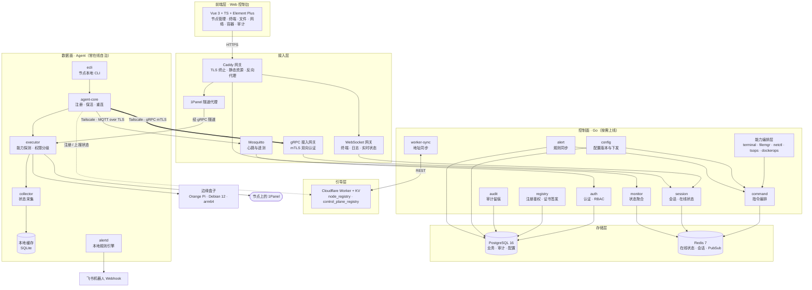
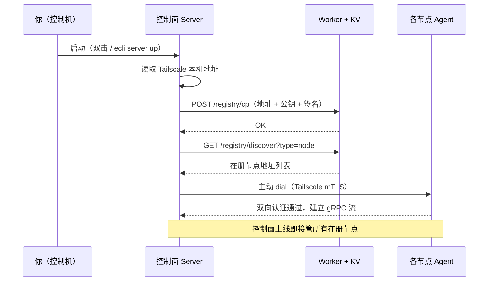
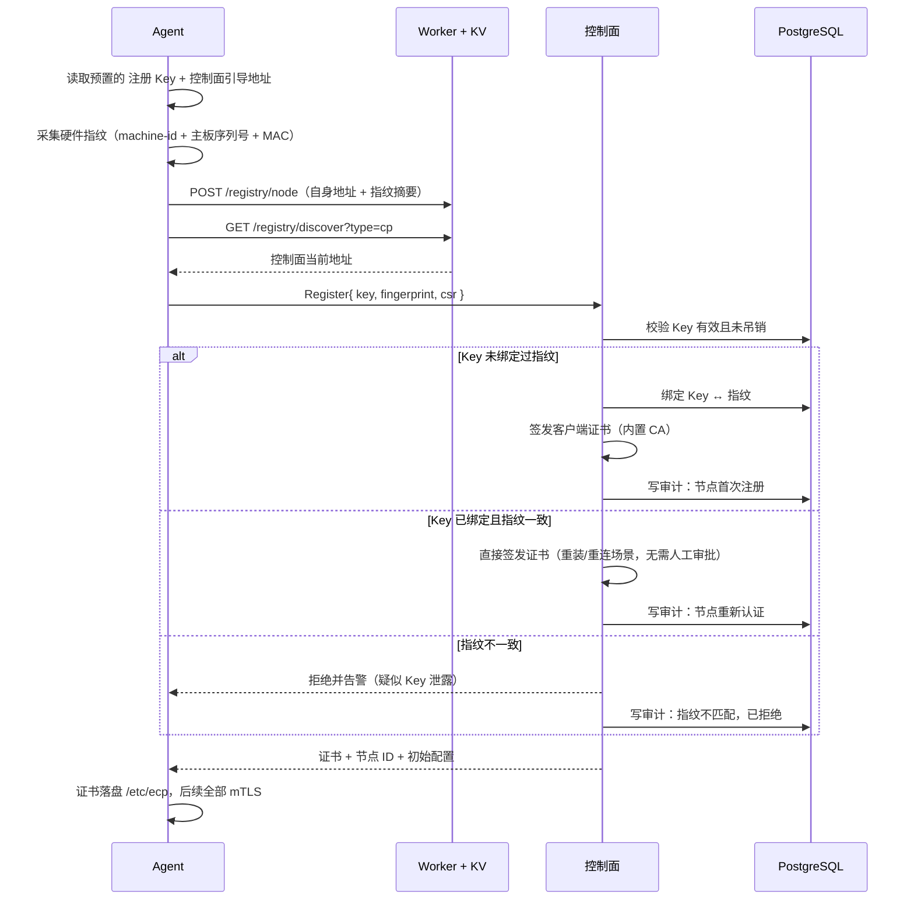
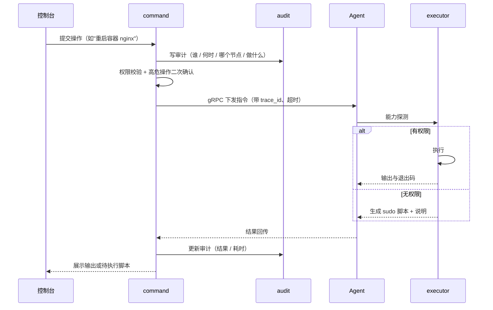
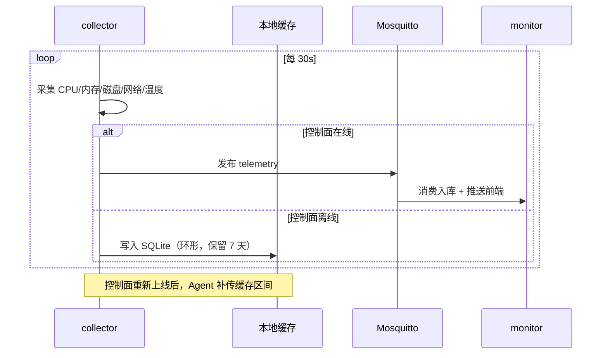
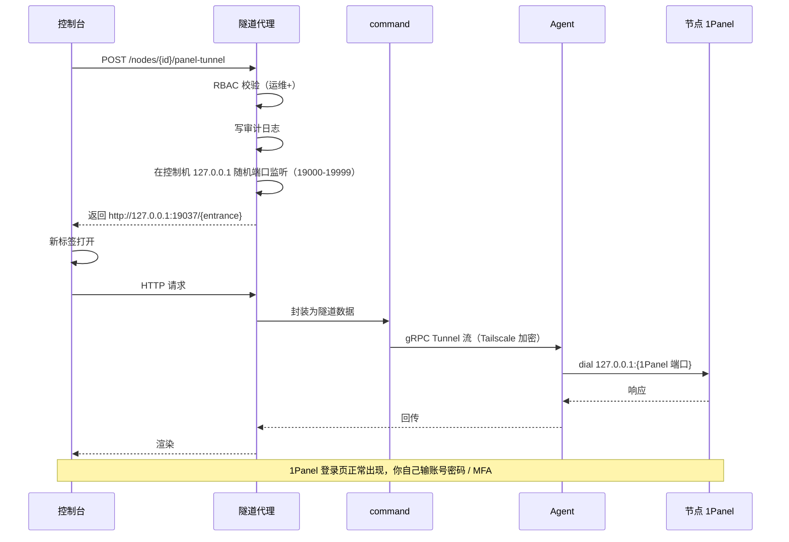
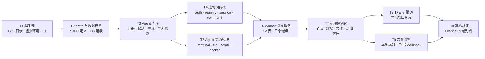

# 边缘计算节点控制平台 · 架构设计 v1.0

> 状态：**待确认**（确认后进入阶段三 · 开发落地）
> 依据：`docs/需求清单.md` v1.1（已确认）
> 创建时间：2026-08-29

---

## 1. 架构总览



**三条关键设计主线**

1. **控制面不在线是常态，不是故障。** 所有节点能力都设计为"配置下发后本地自治执行"，控制面只是下发意图与回收结果的终端。
2. **Worker 只做地址簿。** 它不知道节点上跑了什么、不转发一字节业务流量。控制面连续宕机一个月，节点照样按最后配置运行、照样告警。
3. **Agent 默认无 root。** 功能按权限分级，需要提权的操作不静默失败，而是生成脚本交给人执行。

---

## 2. 分层职责

### 2.1 前端层

| 模块 | 职责 | 关键技术 |
|---|---|---|
| 节点总览 | 节点列表、在线状态、资源水位、批量操作 | Element Plus Table + WebSocket 实时刷新 |
| Web SSH 终端 | 浏览器内 shell，多标签、会话保活、断线重连 | xterm.js + WebSocket |
| 文件管理器 | 目录树、上传下载、在线编辑、权限查看 | 自研树组件 + 分片上传 |
| 网络配置 | 网卡/IP/DNS/hosts 查看与下发、防火墙规则、连通性诊断 | 表单 + 结果回显 |
| Tailscale 纳管 | 接入参数下发、状态可视化、路由查看 | — |
| 容器管理 | 容器列表、启停、日志、部署 | — |
| 1Panel 入口 | 一键打开节点上的 1Panel | 本地端口转发，见 §7 |
| 告警中心 | 规则配置（下发到节点）、告警历史 | — |
| 审计日志 | 按人/节点/时间/操作类型检索 | — |
| 用户与角色 | RBAC 三级管理 | — |

### 2.2 接入层

| 组件 | 职责 |
|---|---|
| Caddy 网关 | TLS 终止、静态资源托管、API 反向代理。选 Caddy 而非 Nginx：自动证书、配置简洁、原生支持 WebSocket 与 HTTP/3 |
| WebSocket 网关 | 承载终端会话、实时日志、状态推送 |
| gRPC 接入网关 | 节点长连接入口，强制 mTLS，校验客户端证书 CN 与节点 ID 绑定关系 |
| Mosquitto | 心跳与遥测的 MQTT broker，仅在内网/Tailscale 可达 |
| 1Panel 隧道代理 | 把节点本地的 1Panel 端口映射到控制机本地端口，见 §7 |

### 2.3 控制面（Go 单体，按需上线）

| 模块 | 职责 |
|---|---|
| `auth` | JWT 登录、RBAC 鉴权、API Key 管理 |
| `registry` | 注册 Key 签发/吊销、硬件指纹绑定、内置 CA 签发节点证书 |
| `session` | gRPC 流会话表、心跳判定、在线状态写入 Redis |
| `command` | 指令编排：排队、超时、重试、结果回传、并发控制 |
| `config` | 配置版本管理、下发、灰度、回滚 |
| 能力编排层 | `terminal` / `filemgr` / `netctl` / `tsops` / `dockerops` 五个能力适配器，对上统一接口，对下走 `command` 下发 |
| `monitor` | 遥测聚合、指标缓存、历史状态查询 |
| `alert` | 告警规则编辑与下发到节点（**规则执行在节点本地**） |
| `audit` | 审计日志写入，不可删除 |
| `worker-sync` | 启动时向 Worker 注册控制面地址；定期拉取节点表；退出时清理 |

### 2.4 数据面（Agent，Go 静态二进制，常在线）

| 模块 | 职责 |
|---|---|
| `agent-core` | 注册、证书续期、保活、断线重连（指数退避）、从 Worker 发现控制面地址 |
| `executor` | 指令执行器。**先做能力探测**（有没有权限、命令存不存在），再决定直接执行还是降级生成脚本 |
| `collector` | 状态采集（CPU/内存/磁盘/网络/温度/容器），控制面离线时写入本地缓存 |
| 本地缓存 | SQLite，缓存最近 N 条状态与控制面离线期间的操作结果，上线后补传 |
| `alertd` | 本地告警规则引擎，触发后直连飞书 Webhook，**不依赖控制面** |
| `ecli` | 节点本地 CLI，现场运维用：查状态、改配置、手动重连、查看本节点审计 |

### 2.5 存储层

| 组件 | 存什么 | 关键设计 |
|---|---|---|
| PostgreSQL 16 | 节点、凭据、用户角色、配置与版本、审计日志、告警规则 | 凭据字段加密存储；审计表 append-only |
| Redis 7 | 在线状态、gRPC 会话映射、PubSub、限流 | 控制面重启后可丢，节点状态由重连重建 |
| SQLite（Agent 本地） | 状态缓存、离线期间操作结果、本地告警历史 | 单文件，随 Agent 走 |

### 2.6 引导层（Cloudflare Worker + KV）

两张表，仅此而已：

| KV Key | Value | 写入方 | TTL |
|---|---|---|---|
| `node:{node_id}` | `{ tailscale_ip, grpc_port, fingerprint, status, last_seen }` | Agent | 心跳续期，48h 过期 |
| `cp:{instance_id}` | `{ tailscale_ip, grpc_port, api_port, pubkey, last_seen }` | 控制面 | 心跳续期，24h 过期 |

**暴露三个端点**：`POST /registry/node`、`POST /registry/cp`、`GET /registry/discover?type=node|cp`。全部要求 `Authorization: Bearer <引导令牌>`，令牌与平台主凭据隔离，泄露也不影响节点控制权。

---

## 3. 关键数据流

### 3.1 控制面启动与地址注册



### 3.2 节点首次注册（上线即控的起点）



**这就是"上线即控"**：Key 与指纹首次绑定后，节点重启、重装系统、断网重连都走第二条分支自动完成，不需要你点任何确认。但每一次都留痕。

### 3.3 指令下发



### 3.4 状态采集与控制面离线



### 3.5 告警（不依赖控制面）

```mermaid
sequenceDiagram
    participant ALT as alert 模块
    participant A as Agent
    participant ALD as alertd
    participant FS as 飞书机器人

    ALT->>A: 下发告警规则（CPU>90% 持续 5min 等）
    A->>ALD: 规则落盘 /etc/ecp/alert-rules.yaml
    loop 本地持续评估
        ALD->>ALD: 读本地采集数据比对规则
        alt 触发
            ALD->>FS: 直连 Webhook 推送
            ALD->>CCH: 记本地告警历史
        end
    end
    Note over ALD,FS: 控制面不在线照常告警
```

### 3.6 打开 1Panel

见 §7。

---

## 4. 关键接口约定

### 4.1 gRPC 服务（控制面 ↔ Agent）

```protobuf
syntax = "proto3";
package ecp.v1;

service AgentService {
  // 节点注册，换取证书
  rpc Register(RegisterRequest) returns (RegisterResponse);

  // 双向流：控制面下发指令，Agent 回传结果与心跳
  rpc CommandStream(stream AgentMessage) returns (stream ControlMessage);

  // 通用隧道：终端、文件、1Panel 端口转发全部复用此流
  rpc Tunnel(stream TunnelChunk) returns (stream TunnelChunk);

  // 控制面离线期间缓存的数据补传
  rpc UploadBacklog(BacklogRequest) returns (BacklogResponse);
}

message RegisterRequest {
  string registration_key = 1;
  string fingerprint      = 2;   // machine-id + 主板序列号 + MAC 的哈希
  bytes  csr              = 3;   // 证书签名请求
  NodeInfo node_info      = 4;   // 主机名 / 架构 / OS / Agent 版本
}

message ControlMessage {
  string trace_id = 1;
  oneof payload {
    Command  command  = 2;   // 执行指令
    ConfigPush config = 3;   // 配置下发
    HeartbeatAck ack  = 4;
  }
}

message AgentMessage {
  string trace_id = 1;
  oneof payload {
    CommandResult result   = 2;
    Heartbeat heartbeat    = 3;
    CapabilityReport caps  = 4;   // 能力探测结果，启动时上报
  }
}
```

**隧道复用是关键决策**：终端、文件传输、1Panel 端口转发三种业务差异很大，但底层都是"双向字节流"。统一走 `Tunnel`，只在上层用 `session_type` 区分，避免三套连接管理逻辑。

### 4.2 REST API（控制台 ↔ 控制面）

| 方法 | 路径 | 说明 | 所需角色 |
|---|---|---|---|
| POST | `/api/v1/auth/login` | 登录 | — |
| GET | `/api/v1/nodes` | 节点列表 | 只读+ |
| GET | `/api/v1/nodes/{id}` | 节点详情 | 只读+ |
| POST | `/api/v1/nodes/{id}/commands` | 下发指令 | 运维+ |
| WS | `/api/v1/nodes/{id}/terminal` | SSH 终端 | 运维+ |
| GET/POST/DELETE | `/api/v1/nodes/{id}/files` | 文件操作 | 运维+ |
| GET/PUT | `/api/v1/nodes/{id}/network` | 网络配置 | 运维+ |
| GET/POST | `/api/v1/nodes/{id}/tailscale` | Tailscale 纳管 | 运维+ |
| GET/POST | `/api/v1/nodes/{id}/containers` | 容器管理 | 运维+ |
| POST | `/api/v1/nodes/{id}/panel-tunnel` | 申请 1Panel 隧道 | 运维+ |
| GET/POST | `/api/v1/alert-rules` | 告警规则 | 运维+ |
| GET | `/api/v1/audit-logs` | 审计日志 | 只读+ |
| GET/POST | `/api/v1/users` `/api/v1/roles` | 用户角色 | 超管 |
| POST | `/api/v1/registration-keys` | 签发/吊销注册 Key | 超管 |

写操作（POST/PUT/DELETE）全部经过审计中间件，无一例外。

### 4.3 MQTT Topic

| Topic | 方向 | 内容 | QoS |
|---|---|---|---|
| `ecp/{node_id}/telemetry` | 上行 | CPU/内存/磁盘/网络/温度 | 0 |
| `ecp/{node_id}/status` | 上行 | 在线状态、Agent 版本、能力清单 | 1 |
| `ecp/{node_id}/event` | 上行 | 容器事件、告警触发、异常 | 1 |

遥测用 QoS 0 丢包无所谓，状态与事件用 QoS 1 保证送达。

### 4.4 Worker API

| 方法 | 路径 | 说明 |
|---|---|---|
| POST | `/registry/node` | Agent 上报自身地址与状态 |
| POST | `/registry/cp` | 控制面注册自身地址 |
| GET | `/registry/discover?type=node\|cp` | 拉取对端地址列表 |

全部需要 `Authorization: Bearer <引导令牌>`。

---

## 5. 核心数据模型

| 表 | 关键字段 | 说明 |
|---|---|---|
| `nodes` | id, hostname, arch, os, agent_version, status, last_seen, tailscale_ip | 节点主表 |
| `node_fingerprints` | node_id, fingerprint, bound_at | Key↔指纹绑定关系，指纹变更触发复核 |
| `registration_keys` | key_hash, created_by, bound_node_id, expires_at, revoked_at | **只存哈希，明文仅在签发时展示一次** |
| `node_credentials` | node_id, cert_serial, issued_at, expires_at | 证书台账 |
| `users` | id, username, password_hash, role, mfa_secret | — |
| `audit_logs` | id, ts, user_id, node_id, action, params, result, trace_id | append-only |
| `configs` / `config_versions` | node_id, key, value, version, applied_at | 配置版本可回滚 |
| `alert_rules` | id, node_id, rule_yaml, enabled | 下发到节点本地执行 |
| `commands` | trace_id, node_id, action, status, output, created_at | 指令台账 |
| `panel_targets` | node_id, listen_addr, entrance_path | 1Panel 地址配置 |

---

## 6. 技术选型理由

| 选型 | 为什么不选别的 |
|---|---|
| **Go 写 Agent** | 边缘盒是 arm64，Agent 必须是单文件静态二进制、无运行时依赖、常驻内存压到 20MB 以内。Python 要打包解释器和依赖，体积和启动速度都不合格；Rust 也行但开发周期长，且生态里 SSH/文件/容器操作的现成库不如 Go 成熟 |
| **Go 写控制面** | 与 Agent 共用同一份 `.proto` 和数据模型，避免两套语言对齐接口的成本。Gin 处理 REST、gRPC 处理节点长连接，一个进程搞定，单机部署不需要微服务拆分 |
| **MQTT 上行 + gRPC 下行** | 遥测是高频小包、允许丢，MQTT 的 QoS 语义天然匹配；指令下发要强类型、要流、要双向认证，gRPC 的 mTLS 双向流是标准答案。**反过来用就别扭**：MQTT 传 SSH 流要自己做分片和顺序保证，gRPC 传高频心跳则太重 |
| **PostgreSQL** | 审计日志和配置版本需要事务与复杂查询，SQLite 在并发写入上是瓶颈，MySQL 在 JSONB（节点元数据）上弱一档 |
| **Redis** | 在线状态和控制面会话本质是易失数据，控制面重启就该丢、由节点重连重建。放 PG 里是浪费 |
| **Mosquitto 而非 EMQX** | 单机 500 节点，Mosquitto 内存占用几十 MB 足够。EMQX 的集群和规则引擎在单机私有化场景下用不上，反而多吃资源 |
| **Caddy 而非 Nginx** | 自动证书、配置十行搞定、原生支持 WebSocket 升级和 HTTP/3。控制面是按需启动的个人管理终端，要的是"别让我配半天" |
| **Vue 3 + Element Plus** | 文件管理器的树组件、审计日志的复杂筛选表格、终端的多标签——这些 Element Plus 开箱即用。React 生态同样成熟，但你已经指定了 Vue |
| **xterm.js** | Web 终端的事实标准，没有替代品 |
| **SQLite 做 Agent 本地缓存** | 单文件、零依赖、随 Agent 走。BoltDB 也行但查询能力弱，离线期间要按时间范围补传数据时不好用 |
| **控制面跑本机进程，不进 Docker** | 见 §8 |

---

## 7. 1Panel 集成方案（新增需求 C11）

### 需求与红线

你要的是：在 ECP 面板里点一下就打开那个节点的 1Panel。

**红线**：只解决**网络可达**，**不绕过 1Panel 自身的鉴权**。登录账号密码、MFA 仍然由你自己输。我不会去读 1Panel 的凭据文件（那在 `/opt/1panel` 下，需要 root，且属于"A6 完全隔离"禁止触碰的范围），也不会生成免密票据。

### 三个方案对比

| 方案 | 做法 | 优点 | 缺点 |
|---|---|---|---|
| **A. 路径反向代理** | 控制面暴露 `/relay/{ticket}/`，流量经 Agent 隧道打到节点 1Panel | 任何能访问控制台的浏览器都能用 | SPA 路由与 Cookie Path 要重写，1Panel 前端有踩坑风险；WebSocket（1Panel 终端）要额外处理 Upgrade |
| **B. 本地端口转发** ✅ | 控制机本机开 `127.0.0.1:{port}`，流量经 Agent 隧道打到节点 1Panel，浏览器直接开这个地址 | **无同源问题，1Panel 完全无感，最稳**；终端 WebSocket 天然可用 | 只能在运行控制面的那台机器的浏览器上用 |
| **C. Tailscale 直连** | 直接访问 `http://{节点 Tailscale IP}:{端口}/{入口}` | 零开发量 | 需要改 1Panel 监听地址（默认只听 127.0.0.1），而且要改就得动 1Panel 配置——违反 A6 |

### 推荐：一期做 B，代码里预留 A

你的使用场景是"控制机就是我自己在用的这台机器"，B 完全够用且最稳。A 的隧道底层和 A/B 是同一套，二期补个 HTTP 反向代理层即可。

**B 的完整链路**：



**安全约束**：
- 监听**只绑 127.0.0.1**，不对外暴露
- 隧道票据绑定 `user_id + node_id`，有效期 30 分钟，关闭标签即回收
- 连接建立与关闭都写审计日志
- 空闲 10 分钟自动断开

**需要你提供的信息**（记入待确认 §12）：节点上 1Panel 的实际监听端口与安全入口路径（entrance）。不知道的话可以用 `1pctl user-info` 查，或者直接在 1Panel 面板的"面板设置"里看。

---

## 8. 部署形态

**关键决策：控制面 Server 不进 Docker，直接跑本机进程。**

| 组件 | 运行方式 | 理由 |
|---|---|---|
| 控制面 Server | **本机二进制进程** | ① 按需启动，双击即开，不要等容器编排；② 1Panel 端口转发需要在控制机开本地监听，跑在容器里要处理端口映射，自找麻烦；③ 单文件，升级就是换二进制 |
| PostgreSQL / Redis / Mosquitto | Docker Compose | 这三个是常驻基础设施，容器化便于备份与版本锁定，arm64 官方镜像齐全 |
| Agent | 节点本地 systemd 服务（用户级） | 常在线、开机自启 |
| Worker | Cloudflare 部署 | 无服务器 |

**控制机（你的 Windows）目录**：

```
ecp-control/
├── server.exe            # 控制面二进制
├── ecli.exe              # 管理端 CLI（可选）
├── config.yaml
├── runtime/
│   ├── certs/            # 内置 CA 与服务端证书
│   ├── data/             # PG 数据卷
│   └── docker-compose.yml
└── web/                  # 前端构建产物，由 Caddy 托管
```

**节点目录（完全隔离，遵守 A6）**：

```
/opt/ecp-agent/           # 二进制 + 本地缓存 SQLite
/etc/ecp/                 # 配置、注册 Key、客户端证书、告警规则
~/.config/systemd/user/   # 用户级 systemd 单元（无需 root）
```

**端口规划**（避开 1Panel 的 8080/8081 与常见业务端口）：

| 端口 | 用途 | 监听范围 |
|---|---|---|
| 8443 | 控制台 HTTPS | 控制机本地 + Tailscale |
| 7443 | gRPC 接入（mTLS） | Tailscale |
| 7883 | MQTT over TLS | Tailscale |
| 19000-19999 | 1Panel 隧道本地转发 | **仅 127.0.0.1** |

---

## 9. 安全设计

| 层面 | 措施 |
|---|---|
| 节点接入 | 注册 Key（只存哈希，明文仅展示一次）+ 硬件指纹绑定 + 内置 CA 签发客户端证书 |
| 传输 | 节点↔控制面全程 mTLS；控制台 HTTPS；Tailscale 承载跨网流量，公网不裸奔 |
| 凭据 | SSH 凭据、Tailscale 密钥、飞书 Webhook 在 PG 中 AES-GCM 加密，主密钥从环境变量或系统密钥环读取，**不入库、不入代码** |
| 授权 | RBAC 三级；每个写操作校验角色；1Panel 隧道额外校验 `user_id + node_id` 绑定 |
| 审计 | 所有写操作留痕（谁/何时/哪个节点/做什么/结果/trace_id）；审计表 append-only；指纹不匹配、Key 复用、高危操作单独标记 |
| 高危操作 | rm、iptables、重启、重装、容器删除触发二次确认 |
| 引导层 | Worker 引导令牌与平台主凭据隔离；即使泄露也无法接管节点 |

---

## 10. Agent 权限分级与降级策略

Agent 以普通用户运行，功能按权限分三档：

| 档位 | 能力 | 无权限时的行为 |
|---|---|---|
| **用户态可执行** | 状态采集、日志读取、文件读写（用户对目标路径有权限时）、SSH 会话（pty）、容器只读查询、配置读取 | — |
| **需提权** | Tailscale up/down、iptables/nftables、systemd 服务管理、Docker 写操作（需 docker 组）、Agent 自升级 | **生成脚本 + 说明**，控制台展示"请手动执行"按钮，复制后在节点上 `sudo bash` |
| **禁止** | 读取 1Panel 凭据、修改 1Panel 配置、触碰现有业务目录 | 直接拒绝，不生成脚本 |

启动时 `executor` 做一次能力探测，把结果上报控制面（含在 `CapabilityReport` 里），控制台据此显示每个节点哪些功能可用、哪些需要提权。**不做静默失败**——用户永远知道某操作为什么没生效。

---

## 11. 一期开发任务拆解



每个 T 完成后：写 `开发日志/<Agent名称>/<日期时间>/任务.md` → Git 提交（编号）→ 推送。

---

## 12. 待确认事项

| # | 事项 | 阻塞什么 |
|---|---|---|
| H1 | **Git 远程仓库地址** | 全部提交无法推送。本地已可提交，但满足不了你"推送云端"的要求 |
| H2 | **节点上 1Panel 的监听端口与安全入口路径** | C11 开发。可用 `1pctl user-info` 或面板设置查看 |
| H3 | **Tailscale 现状**：控制机与 Orange Pi 是否已在同一个 tailnet？节点的 Tailscale IP/主机名是？ | 联调 |
| H4 | **Cloudflare Worker 现状**：是否已有项目与 KV namespace？ | T6 |
| H5 | **Orange Pi 的 SSH 普通用户名** + 专用密钥对（私钥放 `.deploy/ssh/`，已 gitignore） | 真机验证 |
| H6 | **飞书机器人 Webhook 地址** | T9，可延后 |
| H7 | 1Panel 方案 B（本地端口转发）是否接受？还是要 A（路径反代，支持远程浏览器访问）？ | C11 实现路径 |

---

## 附：需求 → 架构决策映射

| 需求 | 架构决策 |
|---|---|
| 控制面不保证在线 | 节点自治 + 本地缓存补传 + 告警本地执行 |
| 边缘节点稳定性差、上线即控 | Key↔指纹绑定，重装自动重认证，全程审计 |
| Worker 只是映射表 | 只存两张 KV 表、三个端点，零业务流量 |
| 双向注册谁在线谁发起 | 控制面上线主动 dial + Agent 轮询发现，双保险 |
| 只给普通用户，sudo 手动敲 | 能力探测 + 三档权限分级 + 脚本降级 |
| 完全隔离不碰 1Panel 和业务 | 独立目录端口；1Panel 只做端口转发，不读凭据 |
| arm64 + amd64 混合 | Go 交叉编译双架构产物；容器镜像全部 arm64 兼容 |
| 试点 500 节点 | 单机单体架构，但 gRPC 连接池、Redis 状态、MQTT QoS 按 5 万节点设计 |
